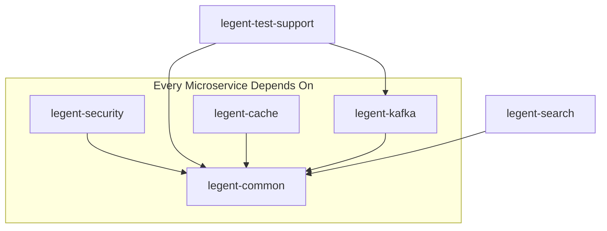
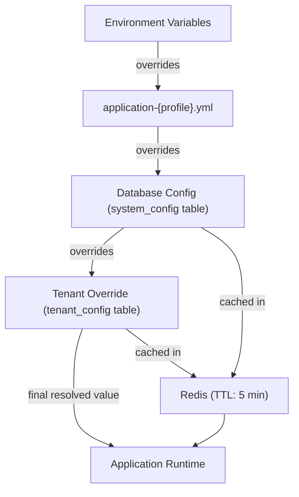
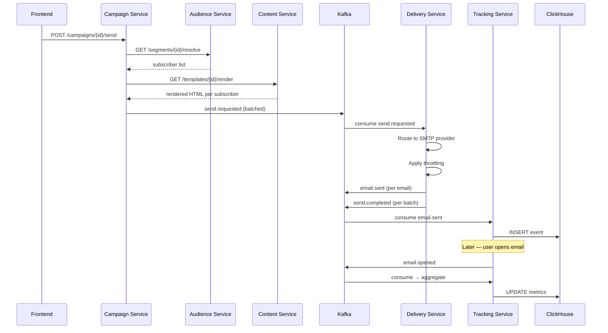
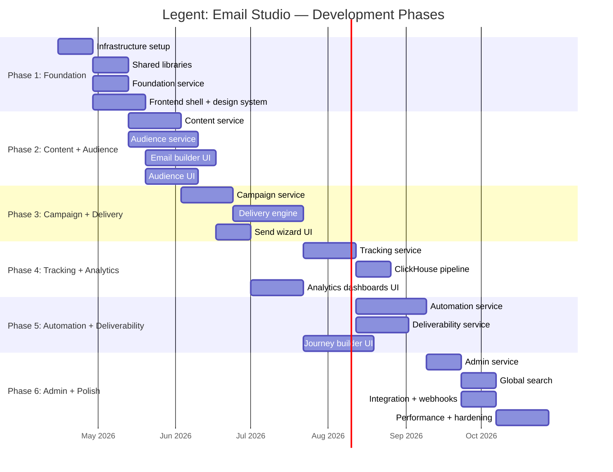

# Legent: Email Studio — Architecture Blueprint

> A Salesforce Marketing Cloud – Email Studio Replica

---

## 1. High-Level Architecture

```mermaid
graph TB
    subgraph CLIENT["Client Layer"]
        WEB["Next.js Web App"]
        API_SDK["Public API / SDK"]
    end

    subgraph GATEWAY["Edge Layer"]
        NGINX["Nginx / Kong Gateway"]
        AUTH["Auth Filter"]
        RATE["Rate Limiter"]
    end

    subgraph SERVICES["Microservices Layer"]
        FOUNDATION["Foundation Service"]
        AUDIENCE["Audience Service"]
        CONTENT["Content Service"]
        CAMPAIGN["Campaign Service"]
        DELIVERY["Delivery Engine"]
        TRACKING["Tracking Service"]
        AUTOMATION["Automation Service"]
        COMPLIANCE["Deliverability Service"]
        ADMIN["Admin Service"]
    end

    subgraph DATA["Data Layer"]
        PG_FOUND[("PostgreSQL – Foundation")]
        PG_AUD[("PostgreSQL – Audience")]
        PG_CONTENT[("PostgreSQL – Content")]
        PG_CAMP[("PostgreSQL – Campaign")]
        PG_DEL[("PostgreSQL – Delivery")]
        PG_AUTO[("PostgreSQL – Automation")]
        PG_COMP[("PostgreSQL – Compliance")]
        PG_ADMIN[("PostgreSQL – Admin")]
        CH[("ClickHouse – Analytics")]
    end

    subgraph INFRA["Infrastructure Layer"]
        KAFKA["Apache Kafka"]
        REDIS["Redis Cluster"]
        OPENSEARCH["OpenSearch"]
        MINIO["MinIO Object Store"]
    end

    subgraph EXTERNAL["External / Togglable"]
        POSTAL["Postal SMTP"]
        SES["Amazon SES"]
        PDNS["PowerDNS"]
        CF["Cloudflare CDN"]
    end

    WEB --> NGINX
    API_SDK --> NGINX
    NGINX --> AUTH --> RATE
    RATE --> FOUNDATION
    RATE --> AUDIENCE
    RATE --> CONTENT
    RATE --> CAMPAIGN
    RATE --> DELIVERY
    RATE --> TRACKING
    RATE --> AUTOMATION
    RATE --> COMPLIANCE
    RATE --> ADMIN

    FOUNDATION --> PG_FOUND
    AUDIENCE --> PG_AUD
    CONTENT --> PG_CONTENT
    CAMPAIGN --> PG_CAMP
    DELIVERY --> PG_DEL
    AUTOMATION --> PG_AUTO
    COMPLIANCE --> PG_COMP
    ADMIN --> PG_ADMIN
    TRACKING --> CH

    SERVICES --> KAFKA
    SERVICES --> REDIS
    SERVICES --> OPENSEARCH
    CONTENT --> MINIO

    DELIVERY --> POSTAL
    DELIVERY --> SES
    COMPLIANCE --> PDNS
    CONTENT --> CF
```



### Architecture Characteristics

| Characteristic | Strategy |
|:---|:---|
| **Multi-Tenancy** | Shared database, tenant column on every table, enforced via Hibernate filters + Spring interceptor |
| **Statelessness** | All services are stateless; session/state held in Redis or Kafka |
| **API-First** | OpenAPI 3.1 contracts defined before implementation |
| **Config-Driven** | All behavior toggles stored in DB, cached in Redis, overridable per tenant |
| **Database-per-Service** | Each microservice owns its own PostgreSQL schema (logical isolation within shared cluster) |
| **CQRS** | Write path goes through PostgreSQL; read/analytics path through ClickHouse |
| **Resilience** | Circuit breaker (Resilience4j), retry + DLQ, idempotency keys on all mutations |

---

## 2. Module Boundaries (Bounded Contexts)

Each module is a **DDD Bounded Context** with its own domain model, data store, API surface, and event contracts.

```mermaid
graph LR
    subgraph Foundation["Foundation Context"]
        F1["Tenant Management"]
        F2["Feature Flags"]
        F3["System Config"]
        F4["Auth & RBAC"]
        F5["Health & Monitoring"]
    end

    subgraph Audience["Audience Context"]
        A1["Subscribers"]
        A2["Lists & Groups"]
        A3["Data Extensions"]
        A4["Segments"]
        A5["Import / Export"]
        A6["Suppression"]
    end

    subgraph Content["Content Context"]
        C1["Email Templates"]
        C2["Drag-and-Drop Builder"]
        C3["HTML Editor"]
        C4["Content Blocks"]
        C5["Asset Management"]
        C6["Personalization Tokens"]
    end

    subgraph Campaign["Campaign Context"]
        CA1["Campaign Definition"]
        CA2["Audience Resolution"]
        CA3["Send Orchestration"]
        CA4["Batch Processing"]
        CA5["Scheduling"]
        CA6["A/B Testing"]
    end

    subgraph Delivery["Delivery Context"]
        D1["SMTP Abstraction"]
        D2["Provider Routing"]
        D3["Retry Engine"]
        D4["Bounce Processor"]
        D5["Throttling"]
    end

    subgraph Tracking["Tracking Context"]
        T1["Event Ingestion"]
        T2["Open / Click Tracking"]
        T3["Aggregation Pipeline"]
        T4["Dashboards & Reports"]
    end

    subgraph Automation["Automation Context"]
        AU1["Workflow Definitions"]
        AU2["State Machine"]
        AU3["Trigger Engine"]
        AU4["Delay / Timer"]
        AU5["Journey Builder"]
    end

    subgraph Deliverability["Deliverability Context"]
        DV1["SPF / DKIM / DMARC"]
        DV2["Spam Scoring"]
        DV3["Reputation Tracker"]
        DV4["Domain Config"]
        DV5["Bounce Classification"]
    end

    subgraph Admin["Admin & Integration Context"]
        AD1["Branding Config"]
        AD2["Validation Rules"]
        AD3["Global Search"]
        AD4["Notifications"]
        AD5["Webhook Registry"]
        AD6["External API Bridge"]
    end

    Campaign -->|"resolves audience"| Audience
    Campaign -->|"resolves content"| Content
    Campaign -->|"submits send jobs"| Delivery
    Delivery -->|"emits events"| Tracking
    Automation -->|"triggers campaigns"| Campaign
    Deliverability -->|"informs routing"| Delivery
    Admin -->|"indexes all entities"| Foundation
```



### Cross-Context Communication Rules

| Communication Type | Mechanism | Example |
|:---|:---|:---|
| **Synchronous Query** | REST via Gateway (read-only) | Campaign → Audience: resolve segment count |
| **Asynchronous Command** | Kafka event | Campaign → Delivery: `send.requested` |
| **Data Replication** | Kafka CDC stream | Audience → OpenSearch: subscriber index sync |
| **Shared Reference Data** | Redis cache | Tenant config, feature flags |

---

## 3. Complete Repository Structure

The project uses a **monorepo** layout for coordination across services.

```
legent-email-studio/
│
├── README.md
├── docker-compose.yml                    # Local development environment
├── docker-compose.infra.yml              # Infrastructure services only
├── Makefile                              # Build/run shortcuts
│
├── docs/                                 # Architecture documentation
│   ├── architecture/
│   │   ├── high-level-architecture.md
│   │   ├── module-boundaries.md
│   │   ├── event-catalog.md
│   │   └── api-conventions.md
│   ├── runbooks/
│   └── adr/                              # Architecture Decision Records
│       ├── 001-monorepo-structure.md
│       ├── 002-multi-tenant-strategy.md
│       └── 003-cqrs-strategy.md
│
├── config/                               # Centralized configuration
│   ├── environments/
│   │   ├── application-local.yml
│   │   ├── application-dev.yml
│   │   ├── application-staging.yml
│   │   └── application-prod.yml
│   ├── kafka/
│   │   ├── topics.yml                    # Topic definitions
│   │   └── consumer-groups.yml
│   ├── nginx/
│   │   ├── nginx.conf
│   │   └── upstream.conf
│   └── provider-toggles/
│       ├── smtp-providers.yml
│       ├── gateway-providers.yml
│       └── cdn-providers.yml
│
├── shared/                               # Shared Java libraries
│   ├── legent-common/
│   │   ├── pom.xml
│   │   └── src/main/java/com/legent/common/
│   │       ├── model/
│   │       │   ├── BaseEntity.java
│   │       │   ├── TenantAwareEntity.java
│   │       │   └── AuditableEntity.java
│   │       ├── dto/
│   │       │   ├── ApiResponse.java
│   │       │   ├── PagedResponse.java
│   │       │   └── ErrorResponse.java
│   │       ├── exception/
│   │       │   ├── LegentException.java
│   │       │   ├── NotFoundException.java
│   │       │   ├── ConflictException.java
│   │       │   └── GlobalExceptionHandler.java
│   │       ├── util/
│   │       │   ├── IdGenerator.java
│   │       │   ├── JsonUtil.java
│   │       │   └── DateTimeUtil.java
│   │       └── constant/
│   │           └── AppConstants.java
│   │
│   ├── legent-security/
│   │   ├── pom.xml
│   │   └── src/main/java/com/legent/security/
│   │       ├── TenantContext.java
│   │       ├── TenantFilter.java
│   │       ├── TenantInterceptor.java
│   │       ├── JwtTokenProvider.java
│   │       └── RbacEvaluator.java
│   │
│   ├── legent-kafka/
│   │   ├── pom.xml
│   │   └── src/main/java/com/legent/kafka/
│   │       ├── config/
│   │       │   ├── KafkaProducerConfig.java
│   │       │   └── KafkaConsumerConfig.java
│   │       ├── model/
│   │       │   ├── DomainEvent.java
│   │       │   └── EventEnvelope.java
│   │       ├── producer/
│   │       │   └── EventPublisher.java
│   │       ├── consumer/
│   │       │   ├── EventConsumer.java
│   │       │   └── DlqHandler.java
│   │       └── serde/
│   │           └── JsonEventSerializer.java
│   │
│   ├── legent-cache/
│   │   ├── pom.xml
│   │   └── src/main/java/com/legent/cache/
│   │       ├── config/
│   │       │   └── RedisConfig.java
│   │       ├── service/
│   │       │   ├── CacheService.java
│   │       │   └── TenantCacheKeyGenerator.java
│   │       └── annotation/
│   │           └── TenantCacheable.java
│   │
│   ├── legent-search/
│   │   ├── pom.xml
│   │   └── src/main/java/com/legent/search/
│   │       ├── config/
│   │       │   └── OpenSearchConfig.java
│   │       ├── service/
│   │       │   └── SearchIndexService.java
│   │       └── model/
│   │           └── SearchableDocument.java
│   │
│   └── legent-test-support/
│       ├── pom.xml
│       └── src/main/java/com/legent/test/
│           ├── BaseIntegrationTest.java
│           ├── TestContainersConfig.java
│           ├── MockTenantContext.java
│           └── KafkaTestHelper.java
│
├── services/                             # Backend Microservices
│   │
│   ├── foundation-service/
│   │   ├── pom.xml
│   │   ├── Dockerfile
│   │   └── src/
│   │       ├── main/
│   │       │   ├── java/com/legent/foundation/
│   │       │   │   ├── FoundationApplication.java
│   │       │   │   ├── config/
│   │       │   │   │   ├── AppConfig.java
│   │       │   │   │   ├── SecurityConfig.java
│   │       │   │   │   └── CorsConfig.java
│   │       │   │   ├── controller/
│   │       │   │   │   ├── ConfigController.java
│   │       │   │   │   ├── FeatureFlagController.java
│   │       │   │   │   └── HealthController.java
│   │       │   │   ├── service/
│   │       │   │   │   ├── ConfigService.java
│   │       │   │   │   ├── FeatureFlagService.java
│   │       │   │   │   └── TenantService.java
│   │       │   │   ├── repository/
│   │       │   │   │   ├── ConfigRepository.java
│   │       │   │   │   ├── FeatureFlagRepository.java
│   │       │   │   │   └── TenantRepository.java
│   │       │   │   ├── domain/
│   │       │   │   │   ├── SystemConfig.java
│   │       │   │   │   ├── FeatureFlag.java
│   │       │   │   │   └── Tenant.java
│   │       │   │   ├── dto/
│   │       │   │   │   ├── ConfigDto.java
│   │       │   │   │   ├── FeatureFlagDto.java
│   │       │   │   │   └── TenantDto.java
│   │       │   │   ├── mapper/
│   │       │   │   │   └── ConfigMapper.java
│   │       │   │   └── event/
│   │       │   │       ├── SystemInitializedEvent.java
│   │       │   │       └── ConfigUpdatedEvent.java
│   │       │   └── resources/
│   │       │       ├── application.yml
│   │       │       ├── application-local.yml
│   │       │       └── db/migration/
│   │       │           └── V1__foundation_schema.sql
│   │       └── test/
│   │           └── java/com/legent/foundation/
│   │               ├── controller/
│   │               ├── service/
│   │               └── repository/
│   │
│   ├── audience-service/
│   │   ├── pom.xml
│   │   ├── Dockerfile
│   │   └── src/main/java/com/legent/audience/
│   │       ├── AudienceApplication.java
│   │       ├── config/
│   │       ├── controller/
│   │       │   ├── SubscriberController.java
│   │       │   ├── ListController.java
│   │       │   ├── DataExtensionController.java
│   │       │   ├── SegmentController.java
│   │       │   └── ImportController.java
│   │       ├── service/
│   │       │   ├── SubscriberService.java
│   │       │   ├── ListService.java
│   │       │   ├── DataExtensionService.java
│   │       │   ├── SegmentService.java
│   │       │   ├── SegmentEvaluator.java
│   │       │   ├── ImportService.java
│   │       │   ├── DeduplicationService.java
│   │       │   └── SuppressionService.java
│   │       ├── repository/
│   │       ├── domain/
│   │       ├── dto/
│   │       ├── mapper/
│   │       └── event/
│   │
│   ├── content-service/
│   │   ├── pom.xml
│   │   ├── Dockerfile
│   │   └── src/main/java/com/legent/content/
│   │       ├── ContentApplication.java
│   │       ├── config/
│   │       ├── controller/
│   │       │   ├── TemplateController.java
│   │       │   ├── ContentBlockController.java
│   │       │   └── AssetController.java
│   │       ├── service/
│   │       │   ├── TemplateService.java
│   │       │   ├── TemplateRenderService.java
│   │       │   ├── ContentBlockService.java
│   │       │   ├── AssetStorageService.java
│   │       │   └── PersonalizationService.java
│   │       ├── repository/
│   │       ├── domain/
│   │       ├── dto/
│   │       ├── mapper/
│   │       └── event/
│   │
│   ├── campaign-service/
│   │   ├── pom.xml
│   │   ├── Dockerfile
│   │   └── src/main/java/com/legent/campaign/
│   │       ├── CampaignApplication.java
│   │       ├── config/
│   │       ├── controller/
│   │       │   ├── CampaignController.java
│   │       │   └── SendController.java
│   │       ├── service/
│   │       │   ├── CampaignService.java
│   │       │   ├── AudienceResolverService.java
│   │       │   ├── SendOrchestrationService.java
│   │       │   ├── BatchingService.java
│   │       │   ├── SchedulingService.java
│   │       │   └── AbTestService.java
│   │       ├── repository/
│   │       ├── domain/
│   │       ├── dto/
│   │       ├── mapper/
│   │       ├── saga/
│   │       │   ├── SendSagaOrchestrator.java
│   │       │   └── SendSagaStep.java
│   │       └── event/
│   │
│   ├── delivery-service/
│   │   ├── pom.xml
│   │   ├── Dockerfile
│   │   └── src/main/java/com/legent/delivery/
│   │       ├── DeliveryApplication.java
│   │       ├── config/
│   │       ├── controller/
│   │       │   └── DeliveryStatusController.java
│   │       ├── service/
│   │       │   ├── DeliveryService.java
│   │       │   ├── SmtpAbstractionService.java
│   │       │   ├── ProviderRoutingService.java
│   │       │   ├── RetryService.java
│   │       │   ├── BounceProcessorService.java
│   │       │   └── ThrottlingService.java
│   │       ├── provider/                     # Togglable SMTP providers
│   │       │   ├── SmtpProvider.java          # Interface
│   │       │   ├── PostalProvider.java
│   │       │   └── SesProvider.java
│   │       ├── worker/
│   │       │   ├── DeliveryWorker.java
│   │       │   └── RetryWorker.java
│   │       ├── repository/
│   │       ├── domain/
│   │       ├── dto/
│   │       └── event/
│   │
│   ├── tracking-service/
│   │   ├── pom.xml
│   │   ├── Dockerfile
│   │   └── src/main/java/com/legent/tracking/
│   │       ├── TrackingApplication.java
│   │       ├── config/
│   │       │   └── ClickHouseConfig.java
│   │       ├── controller/
│   │       │   ├── TrackingPixelController.java
│   │       │   ├── ClickRedirectController.java
│   │       │   └── ReportController.java
│   │       ├── service/
│   │       │   ├── EventIngestionService.java
│   │       │   ├── AggregationService.java
│   │       │   └── ReportService.java
│   │       ├── pipeline/
│   │       │   ├── StreamProcessor.java
│   │       │   └── EventBatcher.java
│   │       ├── repository/
│   │       ├── domain/
│   │       ├── dto/
│   │       └── event/
│   │
│   ├── automation-service/
│   │   ├── pom.xml
│   │   ├── Dockerfile
│   │   └── src/main/java/com/legent/automation/
│   │       ├── AutomationApplication.java
│   │       ├── config/
│   │       ├── controller/
│   │       │   ├── WorkflowController.java
│   │       │   └── TriggerController.java
│   │       ├── service/
│   │       │   ├── WorkflowService.java
│   │       │   ├── StateMachineService.java
│   │       │   ├── TriggerService.java
│   │       │   └── DelaySchedulerService.java
│   │       ├── engine/
│   │       │   ├── WorkflowRuntime.java
│   │       │   ├── StepExecutor.java
│   │       │   └── TransitionEvaluator.java
│   │       ├── repository/
│   │       ├── domain/
│   │       ├── dto/
│   │       └── event/
│   │
│   ├── deliverability-service/
│   │   ├── pom.xml
│   │   ├── Dockerfile
│   │   └── src/main/java/com/legent/deliverability/
│   │       ├── DeliverabilityApplication.java
│   │       ├── config/
│   │       ├── controller/
│   │       │   ├── DomainConfigController.java
│   │       │   └── ReputationController.java
│   │       ├── service/
│   │       │   ├── SpfService.java
│   │       │   ├── DkimService.java
│   │       │   ├── DmarcService.java
│   │       │   ├── SpamScoringService.java
│   │       │   ├── ReputationService.java
│   │       │   └── BounceClassificationService.java
│   │       ├── dns/
│   │       │   ├── DnsProvider.java           # Interface
│   │       │   ├── PowerDnsProvider.java
│   │       │   └── CloudflareDnsProvider.java
│   │       ├── repository/
│   │       ├── domain/
│   │       ├── dto/
│   │       └── event/
│   │
│   └── admin-service/
│       ├── pom.xml
│       ├── Dockerfile
│       └── src/main/java/com/legent/admin/
│           ├── AdminApplication.java
│           ├── config/
│           ├── controller/
│           │   ├── BrandingController.java
│           │   ├── ValidationRuleController.java
│           │   ├── SearchController.java
│           │   ├── NotificationController.java
│           │   └── WebhookController.java
│           ├── service/
│           │   ├── BrandingService.java
│           │   ├── ValidationRuleService.java
│           │   ├── GlobalSearchService.java
│           │   ├── NotificationService.java
│           │   └── WebhookRegistryService.java
│           ├── repository/
│           ├── domain/
│           ├── dto/
│           └── event/
│
├── frontend/                             # Next.js Application
│   ├── package.json
│   ├── next.config.js
│   ├── tailwind.config.js
│   ├── tsconfig.json
│   ├── Dockerfile
│   │
│   ├── public/
│   │   ├── fonts/
│   │   └── icons/
│   │
│   ├── src/
│   │   ├── app/                          # Next.js App Router
│   │   │   ├── layout.tsx                # Root layout (shell)
│   │   │   ├── page.tsx                  # Dashboard home
│   │   │   ├── (auth)/
│   │   │   │   ├── login/page.tsx
│   │   │   │   └── layout.tsx
│   │   │   ├── (workspace)/
│   │   │   │   ├── layout.tsx            # Workspace shell (sidebar + header)
│   │   │   │   ├── email/
│   │   │   │   │   ├── page.tsx          # Email listing
│   │   │   │   │   ├── [id]/page.tsx
│   │   │   │   │   └── builder/page.tsx  # Drag-and-drop editor
│   │   │   │   ├── audience/
│   │   │   │   │   ├── page.tsx
│   │   │   │   │   ├── subscribers/page.tsx
│   │   │   │   │   ├── lists/page.tsx
│   │   │   │   │   ├── data-extensions/page.tsx
│   │   │   │   │   └── segments/page.tsx
│   │   │   │   ├── campaigns/
│   │   │   │   │   ├── page.tsx
│   │   │   │   │   ├── [id]/page.tsx
│   │   │   │   │   └── send-wizard/page.tsx
│   │   │   │   ├── automation/
│   │   │   │   │   ├── page.tsx
│   │   │   │   │   └── builder/page.tsx  # Journey builder canvas
│   │   │   │   ├── tracking/
│   │   │   │   │   ├── page.tsx
│   │   │   │   │   └── reports/page.tsx
│   │   │   │   ├── deliverability/
│   │   │   │   │   ├── page.tsx
│   │   │   │   │   └── domains/page.tsx
│   │   │   │   └── admin/
│   │   │   │       ├── page.tsx
│   │   │   │       ├── branding/page.tsx
│   │   │   │       ├── settings/page.tsx
│   │   │   │       └── integrations/page.tsx
│   │   │   └── api/                      # Next.js API routes (BFF)
│   │   │       └── [...proxy]/route.ts
│   │   │
│   │   ├── components/
│   │   │   ├── shell/                    # App shell components
│   │   │   │   ├── Sidebar.tsx
│   │   │   │   ├── SidebarNav.tsx
│   │   │   │   ├── Header.tsx
│   │   │   │   ├── HeaderSearch.tsx
│   │   │   │   ├── WorkspaceArea.tsx
│   │   │   │   ├── RightPanel.tsx
│   │   │   │   └── Breadcrumb.tsx
│   │   │   ├── ui/                       # Design system primitives
│   │   │   │   ├── Button.tsx
│   │   │   │   ├── Input.tsx
│   │   │   │   ├── Select.tsx
│   │   │   │   ├── Modal.tsx
│   │   │   │   ├── Table.tsx
│   │   │   │   ├── DataGrid.tsx
│   │   │   │   ├── Card.tsx
│   │   │   │   ├── Badge.tsx
│   │   │   │   ├── Toast.tsx
│   │   │   │   ├── Tabs.tsx
│   │   │   │   ├── Dropdown.tsx
│   │   │   │   ├── Tooltip.tsx
│   │   │   │   ├── Pagination.tsx
│   │   │   │   └── EmptyState.tsx
│   │   │   ├── email/                    # Email module components
│   │   │   │   ├── DragDropCanvas.tsx
│   │   │   │   ├── BlockPalette.tsx
│   │   │   │   ├── PropertyPanel.tsx
│   │   │   │   ├── HtmlEditor.tsx
│   │   │   │   └── PreviewFrame.tsx
│   │   │   ├── audience/                 # Audience module components
│   │   │   │   ├── SubscriberTable.tsx
│   │   │   │   ├── SegmentBuilder.tsx
│   │   │   │   ├── ImportWizard.tsx
│   │   │   │   └── DataExtensionEditor.tsx
│   │   │   ├── campaign/                 # Campaign module components
│   │   │   │   ├── CampaignCard.tsx
│   │   │   │   └── SendWizard.tsx
│   │   │   ├── automation/              # Automation module components
│   │   │   │   ├── JourneyCanvas.tsx
│   │   │   │   ├── StepNode.tsx
│   │   │   │   └── TriggerConfig.tsx
│   │   │   ├── tracking/                # Analytics module components
│   │   │   │   ├── DashboardWidget.tsx
│   │   │   │   ├── MetricCard.tsx
│   │   │   │   └── ChartPanel.tsx
│   │   │   └── shared/                   # Cross-module shared
│   │   │       ├── FeatureFlag.tsx
│   │   │       ├── TenantSwitcher.tsx
│   │   │       └── LoadingOverlay.tsx
│   │   │
│   │   ├── hooks/
│   │   │   ├── useAuth.ts
│   │   │   ├── useTenant.ts
│   │   │   ├── useFeatureFlag.ts
│   │   │   ├── useApi.ts
│   │   │   └── useDebounce.ts
│   │   │
│   │   ├── lib/
│   │   │   ├── api-client.ts             # Axios / fetch wrapper
│   │   │   ├── auth.ts
│   │   │   └── constants.ts
│   │   │
│   │   ├── stores/                       # Zustand stores
│   │   │   ├── authStore.ts
│   │   │   ├── tenantStore.ts
│   │   │   ├── uiStore.ts
│   │   │   └── emailBuilderStore.ts
│   │   │
│   │   └── styles/
│   │       ├── globals.css
│   │       └── tokens/
│   │           ├── colors.css
│   │           ├── spacing.css
│   │           ├── typography.css
│   │           └── shadows.css
│   │
│   └── tests/
│       ├── unit/
│       └── e2e/
│
├── infrastructure/                       # DevOps & Infrastructure
│   ├── docker/
│   │   ├── base/
│   │   │   └── Dockerfile.java-base      # Shared Java base image
│   │   └── local/
│   │       ├── postgres-init/
│   │       │   └── init-databases.sql     # Create per-service schemas
│   │       ├── kafka-init/
│   │       │   └── create-topics.sh
│   │       └── clickhouse-init/
│   │           └── init-tables.sql
│   │
│   ├── kubernetes/
│   │   ├── base/                         # Kustomize base
│   │   │   ├── namespace.yml
│   │   │   ├── configmap.yml
│   │   │   ├── secrets.yml
│   │   │   └── services/
│   │   │       ├── foundation-service.yml
│   │   │       ├── audience-service.yml
│   │   │       ├── content-service.yml
│   │   │       ├── campaign-service.yml
│   │   │       ├── delivery-service.yml
│   │   │       ├── tracking-service.yml
│   │   │       ├── automation-service.yml
│   │   │       ├── deliverability-service.yml
│   │   │       └── admin-service.yml
│   │   ├── overlays/
│   │   │   ├── dev/
│   │   │   ├── staging/
│   │   │   └── prod/
│   │   └── ingress/
│   │       └── ingress.yml
│   │
│   └── scripts/
│       ├── build-all.sh
│       ├── deploy.sh
│       └── seed-data.sh
│
└── pom.xml                               # Parent POM (Maven multi-module)
```

---

## 4. Microservice Layout

### Service Registry

| # | Service | Port | Database Schema | Primary Data Store | Key Responsibilities |
|:--|:--------|:-----|:----------------|:-------------------|:---------------------|
| 1 | `foundation-service` | 8081 | `legent_foundation` | PostgreSQL | Tenant, config, feature flags, health |
| 2 | `audience-service` | 8082 | `legent_audience` | PostgreSQL + JSONB | Subscribers, lists, data extensions, segments |
| 3 | `content-service` | 8083 | `legent_content` | PostgreSQL + MinIO | Templates, blocks, assets, rendering |
| 4 | `campaign-service` | 8084 | `legent_campaign` | PostgreSQL | Campaigns, send orchestration, scheduling |
| 5 | `delivery-service` | 8085 | `legent_delivery` | PostgreSQL | SMTP routing, throttling, retry, bounce |
| 6 | `tracking-service` | 8086 | `legent_tracking` | ClickHouse | Event ingestion, aggregation, reports |
| 7 | `automation-service` | 8087 | `legent_automation` | PostgreSQL | Workflows, state machine, triggers |
| 8 | `deliverability-service` | 8088 | `legent_deliverability` | PostgreSQL | SPF/DKIM/DMARC, reputation, spam scoring |
| 9 | `admin-service` | 8089 | `legent_admin` | PostgreSQL + OpenSearch | Branding, search, webhooks, notifications |

### Per-Service Internal Layering

Every microservice follows this exact layered structure:

```
service-name/
└── src/main/java/com/legent/{module}/
    ├── {Module}Application.java      # Spring Boot entry point
    ├── config/                       # Spring @Configuration beans
    ├── controller/                   # REST controllers (thin, input validation only)
    ├── service/                      # Business logic
    ├── repository/                   # Data access (JPA repositories)
    ├── domain/                       # JPA entities / domain models
    ├── dto/                          # Request/Response DTOs
    ├── mapper/                       # Entity ↔ DTO mappers (MapStruct)
    ├── event/                        # Kafka event models + publishers
    ├── client/                       # Feign clients to other services (if needed)
    └── {special}/                    # Module-specific (saga/, worker/, engine/, provider/, pipeline/)
```

> [!IMPORTANT]
> **No single file exceeds 200 lines.** If it does, it must be refactored into smaller responsibilities.

---

## 5. Shared Libraries

### Library Dependency Graph



### Library Responsibilities

| Library | Purpose | Key Classes |
|:--------|:--------|:------------|
| **legent-common** | Shared base classes, DTOs, exceptions, utilities | `BaseEntity`, `TenantAwareEntity`, `ApiResponse`, `PagedResponse`, `GlobalExceptionHandler`, `IdGenerator` |
| **legent-security** | Multi-tenant context, JWT, RBAC | `TenantContext` (ThreadLocal), `TenantFilter`, `TenantInterceptor`, `JwtTokenProvider`, `RbacEvaluator` |
| **legent-kafka** | Kafka producer/consumer abstraction, event envelope, DLQ | `EventPublisher`, `EventConsumer`, `DomainEvent`, `EventEnvelope`, `DlqHandler` |
| **legent-cache** | Redis config, tenant-aware caching | `CacheService`, `TenantCacheKeyGenerator`, `@TenantCacheable` annotation |
| **legent-search** | OpenSearch client wrapper, indexing | `SearchIndexService`, `SearchableDocument` |
| **legent-test-support** | TestContainers, mock helpers, Kafka test utilities | `BaseIntegrationTest`, `TestContainersConfig`, `MockTenantContext` |

### API Response Contract (from `legent-common`)

All services return a unified response envelope:

```
{
  "success": true,
  "data": { ... },
  "error": null,
  "meta": {
    "timestamp": "2026-04-08T12:00:00Z",
    "requestId": "uuid",
    "tenantId": "tenant-123"
  },
  "pagination": {                    // Only for list endpoints
    "page": 1,
    "size": 20,
    "totalElements": 1540,
    "totalPages": 77
  }
}
```

---

## 6. Configuration Strategy

### Hierarchy (Highest Priority Wins)



### Resolution Flow

1. **Boot-time**: Spring loads `application.yml` → `application-{profile}.yml` → env vars
2. **Runtime**: Service reads from Redis first (< 50ms). On cache miss → read from PostgreSQL → populate Redis
3. **Tenant override**: Tenant-specific config layered on top of system defaults
4. **Feature flags**: Evaluated per-request via `FeatureFlagService` with same cache strategy

### Config Storage

| Concern | Storage | Cache | TTL |
|:--------|:--------|:------|:----|
| System defaults | `system_config` table (Foundation DB) | Redis `config:{key}` | 5 min |
| Tenant overrides | `tenant_config` table (Foundation DB) | Redis `config:{tenantId}:{key}` | 5 min |
| Feature flags | `feature_flag` table (Foundation DB) | Redis `ff:{tenantId}:{flag}` | 1 min |
| Secrets | K8s Secrets / Vault | Never cached | N/A |
| SMTP/Provider toggle | `provider_config` table (Foundation DB) | Redis `provider:{tenantId}:{type}` | 5 min |

### Provider Toggle System

```
provider_config table:
┌──────────┬──────────────┬──────────────┬─────────────────────┐
│ tenantId │ providerType │ providerName │ config (JSONB)       │
├──────────┼──────────────┼──────────────┼─────────────────────┤
│ *        │ SMTP         │ postal       │ {host, port, ...}   │
│ tenant-1 │ SMTP         │ ses          │ {region, key, ...}  │
│ *        │ GATEWAY      │ nginx        │ {upstream, ...}     │
│ *        │ DNS          │ powerdns     │ {api_url, ...}      │
└──────────┴──────────────┴──────────────┴─────────────────────┘
```

Runtime switching: Change the `providerName` → invalidate Redis key → next request uses new provider. Zero downtime.

---

## 7. Event Flow (High-Level)

### Kafka Topic Catalog

| Topic | Producer | Consumers | Partitions | Purpose |
|:------|:---------|:----------|:-----------|:--------|
| `system.initialized` | Foundation | All services | 1 | System bootstrap signal |
| `config.updated` | Foundation | All services | 3 | Config/flag change broadcast |
| `subscriber.created` | Audience | Tracking, Search | 12 | New subscriber registered |
| `subscriber.updated` | Audience | Tracking, Search | 12 | Profile change |
| `segment.evaluated` | Audience | Campaign | 6 | Segment membership updated |
| `import.completed` | Audience | Admin (notifications) | 3 | Bulk import result |
| `content.published` | Content | Campaign, Search | 6 | Template ready for use |
| `send.requested` | Campaign | Delivery | 24 | Campaign send initiated |
| `send.processing` | Delivery | Tracking | 24 | Batch being delivered |
| `send.completed` | Delivery | Campaign, Tracking | 24 | All batches finished |
| `email.sent` | Delivery | Tracking | 48 | Individual email delivered to SMTP |
| `email.failed` | Delivery | Tracking, Deliverability | 12 | Delivery failure |
| `email.bounced` | Delivery | Deliverability, Audience | 12 | Bounce received |
| `email.opened` | Tracking | Automation | 48 | Open pixel triggered |
| `email.clicked` | Tracking | Automation | 48 | Link click tracked |
| `email.unsubscribed` | Tracking | Audience | 12 | Unsubscribe action |
| `workflow.triggered` | Automation | Automation (self) | 12 | Journey entry event |
| `workflow.step.completed` | Automation | Automation (self) | 12 | Step transition |
| `reputation.updated` | Deliverability | Delivery | 3 | Domain score change |

### Primary Event Flows



### Dead Letter Queue (DLQ) Strategy

| Original Topic | DLQ Topic | Max Retries | Backoff |
|:---------------|:----------|:------------|:--------|
| `send.requested` | `send.requested.dlq` | 5 | Exponential (1s → 32s) |
| `email.sent` | `email.sent.dlq` | 3 | Exponential (1s → 8s) |
| `workflow.triggered` | `workflow.triggered.dlq` | 5 | Exponential (2s → 64s) |
| All others | `{topic}.dlq` | 3 | Fixed 5s |

---

## 8. UI Structure (Layout System)

### App Shell Layout

```
┌──────────────────────────────────────────────────────────────────────┐
│ HEADER                                                               │
│ ┌─────────────┬─────────────────────────────────────┬──────────────┐ │
│ │ Logo + Nav   │ Global Search                      │ User + Theme │ │
│ └─────────────┴─────────────────────────────────────┴──────────────┘ │
├──────────┬───────────────────────────────────────────┬───────────────┤
│ SIDEBAR  │ WORKSPACE AREA                            │ RIGHT PANEL   │
│          │                                           │ (contextual)  │
│ ┌──────┐ │ ┌───────────────────────────────────────┐ │ ┌───────────┐ │
│ │Email │ │ │ Breadcrumb                            │ │ │ Properties│ │
│ │      │ │ ├───────────────────────────────────────┤ │ │           │ │
│ │Audi- │ │ │                                       │ │ │ Details   │ │
│ │ence  │ │ │ Page Content                          │ │ │           │ │
│ │      │ │ │ (routed via App Router)               │ │ │ Actions   │ │
│ │Camp- │ │ │                                       │ │ │           │ │
│ │aigns │ │ │                                       │ │ │           │ │
│ │      │ │ │                                       │ │ │           │ │
│ │Auto- │ │ │                                       │ │ │           │ │
│ │mation│ │ │                                       │ │ │           │ │
│ │      │ │ │                                       │ │ │           │ │
│ │Track-│ │ │                                       │ │ │           │ │
│ │ing   │ │ │                                       │ │ │           │ │
│ │      │ │ └───────────────────────────────────────┘ │ └───────────┘ │
│ │Admin │ │                                           │               │
│ └──────┘ │                                           │               │
├──────────┴───────────────────────────────────────────┴───────────────┤
│ STATUS BAR (optional)                                                │
└──────────────────────────────────────────────────────────────────────┘
```

### Design System Token Architecture

```
styles/tokens/
├── colors.css          → CSS custom properties (--color-primary-50 through --color-primary-900)
├── spacing.css         → --space-1 (4px) through --space-16 (64px)
├── typography.css      → --font-sans, --font-mono, --text-xs through --text-4xl
└── shadows.css         → --shadow-sm through --shadow-2xl
```

These tokens feed into `tailwind.config.js` via the `theme.extend` section, ensuring all Tailwind utilities are built on the design tokens.

### Theme System

| Token | Light | Dark |
|:------|:------|:-----|
| `--bg-primary` | `#FFFFFF` | `#0F172A` |
| `--bg-secondary` | `#F8FAFC` | `#1E293B` |
| `--bg-surface` | `#FFFFFF` | `#334155` |
| `--text-primary` | `#0F172A` | `#F1F5F9` |
| `--text-secondary` | `#475569` | `#94A3B8` |
| `--border-default` | `#E2E8F0` | `#334155` |
| `--accent` | `#3B82F6` | `#60A5FA` |

### State Management (Zustand)

| Store | Scope | Data |
|:------|:------|:-----|
| `authStore` | Global | User session, JWT, permissions |
| `tenantStore` | Global | Active tenant, tenant list |
| `uiStore` | Global | Sidebar state, theme, right panel toggle |
| `emailBuilderStore` | Email module | Canvas blocks, selection, undo/redo stack |

---

## 9. Development Phases

### Phase Roadmap



### Phase Details

---

#### Phase 1: Foundation Platform (Weeks 1–5)

**Goal**: Bootable infrastructure, shared libraries, and an empty but navigable UI shell.

| Deliverable | Details |
|:------------|:--------|
| Docker Compose | PostgreSQL, Kafka, Redis, OpenSearch, MinIO, ClickHouse — all running locally |
| Parent POM | Maven multi-module build with dependency management |
| `legent-common` | Base entities, API response envelope, exception hierarchy |
| `legent-security` | Tenant context (ThreadLocal), JWT filter, RBAC evaluator |
| `legent-kafka` | Producer/consumer abstraction, event envelope, DLQ handler |
| `legent-cache` | Redis config, `@TenantCacheable` |
| `foundation-service` | Config CRUD, feature flags, health endpoints |
| Frontend shell | Sidebar, header, workspace layout, theme toggle, route stubs |
| Design system | Token CSS, Tailwind config, base UI components |
| CI pipeline | Build + lint + test for each service |

---

#### Phase 2: Content & Audience (Weeks 5–10)

**Goal**: Users can create email templates and manage subscriber data.

| Deliverable | Details |
|:------------|:--------|
| `content-service` | Template CRUD, content blocks, asset upload to MinIO, rendering |
| `audience-service` | Subscriber CRUD, lists, data extensions (JSONB), segments, import |
| Email builder UI | Drag-and-drop canvas, block palette, property panel, HTML editor |
| Audience UI | Subscriber table, segment builder, import wizard |
| Kafka topics | `subscriber.created`, `subscriber.updated`, `content.published` |
| OpenSearch index | Subscriber search, template search |

---

#### Phase 3: Campaign & Delivery (Weeks 9–14)

**Goal**: Users can compose and send campaigns to segments.

| Deliverable | Details |
|:------------|:--------|
| `campaign-service` | Campaign CRUD, audience resolution, send orchestration, saga |
| `delivery-service` | SMTP abstraction, Postal + SES providers, retry engine, throttling |
| Send wizard UI | Multi-step wizard: select audience → select content → configure → send |
| Kafka topics | `send.requested`, `send.processing`, `send.completed`, `email.sent`, `email.failed` |
| Provider toggle | Runtime switch between Postal and SES via config |

---

#### Phase 4: Tracking & Analytics (Weeks 13–17)

**Goal**: Track email opens/clicks and surface analytics dashboards.

| Deliverable | Details |
|:------------|:--------|
| `tracking-service` | Tracking pixel endpoint, click redirect, event ingestion |
| ClickHouse pipeline | Stream events from Kafka → ClickHouse, pre-aggregated materialized views |
| Analytics UI | Campaign dashboard, metric cards, charts (opens, clicks, bounces) |
| Kafka topics | `email.opened`, `email.clicked`, `email.unsubscribed` |

---

#### Phase 5: Automation & Deliverability (Weeks 16–22)

**Goal**: Journey automation and email deliverability management.

| Deliverable | Details |
|:------------|:--------|
| `automation-service` | Workflow definitions, state machine runtime, trigger engine, delays |
| `deliverability-service` | SPF/DKIM/DMARC validation, spam scoring, reputation tracker |
| Journey builder UI | Visual canvas for building multi-step journeys |
| DNS integration | PowerDNS + Cloudflare toggle |
| Kafka topics | `workflow.triggered`, `workflow.step.completed`, `reputation.updated` |

---

#### Phase 6: Admin, Search & Hardening (Weeks 21–26)

**Goal**: Administrative controls, global search, and production readiness.

| Deliverable | Details |
|:------------|:--------|
| `admin-service` | Branding, validation rules, notifications, webhook registry |
| Global search | OpenSearch-powered cross-entity search |
| Integrations | Webhook outbound delivery, external API bridge |
| Performance | Load testing, batch optimization, cache tuning |
| Security audit | OWASP checks, PII handling, GDPR compliance |
| Documentation | API docs (Swagger), runbooks, architecture decision records |

---

## User Review Required

> [!IMPORTANT]
> **Multi-Tenancy Strategy**: The plan uses **shared database with tenant column** (row-level isolation). This is the most cost-effective approach but provides softer isolation. If you need **schema-per-tenant** or **database-per-tenant** for compliance, the shared libraries need redesign. Please confirm.

> [!IMPORTANT]
> **Auth Provider**: The architecture assumes JWT-based auth with an internal auth module. Should this integrate with an external IdP (Keycloak, Auth0) instead?

> [!WARNING]
> **Content Service as a separate microservice**: The prompt lists content creation under Email Studio, but a dedicated Content Service enables reuse across Email, Automation, and future SMS channels. Confirm this separation is acceptable.

## Open Questions

1. **Auth approach** — Internal JWT auth vs. external IdP (Keycloak/Auth0)?
2. **Multi-tenant isolation level** — Shared DB with tenant column (current plan) vs. schema-per-tenant?
3. **Email builder engine** — Build custom drag-and-drop from scratch or use an open-source email builder like `react-email-editor` (Unlayer)?
4. **Observability stack** — Should we include Grafana + Prometheus + Jaeger in the infrastructure, or is that out of scope for the initial blueprint?
5. **CI/CD** — Any preferred CI platform (GitHub Actions, GitLab CI, Jenkins)?

---

## Verification Plan

### Phase 1 Validation
- `docker-compose up` boots all infrastructure containers
- `mvn clean install` builds all shared libraries + foundation-service
- Foundation health endpoint returns `200 OK`
- Feature flag API CRUD works with Redis caching
- Frontend shell renders with sidebar navigation and theme toggle
- Kafka topic creation verified via Kafka UI

### Ongoing Validation (Each Phase)
- Unit tests per service (JUnit 5 + Mockito)
- Integration tests with TestContainers
- API contract tests (Spring MockMvc)
- Frontend component tests (React Testing Library)
- E2E smoke tests for critical flows via browser automation
