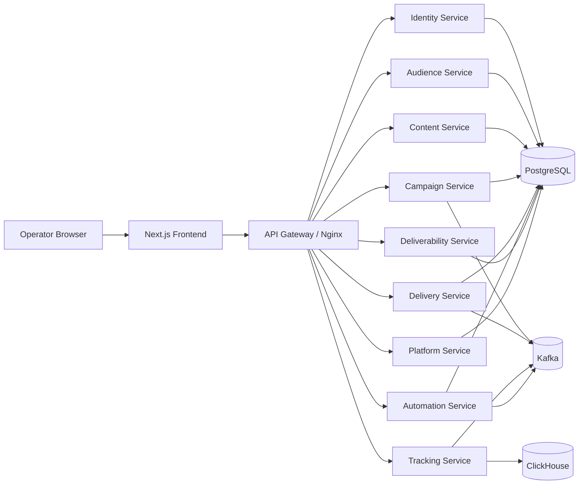

# Quick Guide

## Product In One Paragraph

Legent Email Studio is a governed email marketing and lifecycle platform. It covers public marketing pages, signup/onboarding, authenticated workspace modules, audience management, email/template operations, campaign launch, automation, delivery, deliverability, analytics, admin, and settings.

## Architecture At A Glance



## Main Local Commands

```powershell
copy .env.example .env
docker compose up -d
.\mvnw.cmd clean install -DskipTests -T 1C
cd frontend
npm install
npm run dev
```

Frontend: `http://localhost:3000`

Backend API convention: `/api/v1`, with tenant/workspace context headers for workspace APIs.

## Major Modules

| Service | Port | Database | Controllers | Entities | Migrations | Responsibility |
| --- | --- | --- | --- | --- | --- | --- |
| audience-service | 8082 | ${DB_NAME:legent_audience | 9 | 12 | 13 | Subscribers, lists, segments, imports, consent, suppressions, preferences. |
| automation-service | 8086 | ${DB_NAME:legent_automation | 2 | 5 | 3 | Workflow definitions, graph validation, schedules, runs, simulations. |
| campaign-service | 8083 | ${DB_NAME:legent_campaign | 5 | 17 | 13 | Campaigns, audiences, approvals, experiments, budgets, frequency, send jobs. |
| content-service | 8090 | ${DB_NAME:legent_content | 8 | 14 | 7 | Email templates, content blocks, assets, landing pages, test sends, approvals. |
| deliverability-service | 8087 | ${DB_NAME:legent_deliverability | 5 | 6 | 7 | Sender domains, DNS verification, reputation, spam scoring, DMARC, suppression. |
| delivery-service | 8084 | ${DB_NAME:legent_delivery | 2 | 12 | 11 | Provider routing, queue operations, replay, warmup, rate limits, safety evaluation. |
| foundation-service | 8081 | ${DB_NAME:legent_foundation | 15 | 11 | 11 | Tenants, feature flags, branding, admin configuration, bootstrap, public content. |
| identity-service | 8089 | ${DB_NAME:legent_identity | 2 | 11 | 8 | Authentication, sessions, account membership, onboarding state, preferences. |
| platform-service | 8088 | ${DB_NAME:legent_platform | 4 | 6 | 4 | Notifications, webhooks, search indexing, tenant integration utilities. |
| tracking-service | 8085 | ${DB_NAME:legent_tracking | 4 | 3 | 7 | Open/click ingestion, analytics summaries, funnels, websocket analytics. |

## Fast Validation

```powershell
.\mvnw.cmd test
cd frontend
npm run build
npm run test:e2e -- --project=chromium
cd ..
python simulate_e2e_flow.py
```
