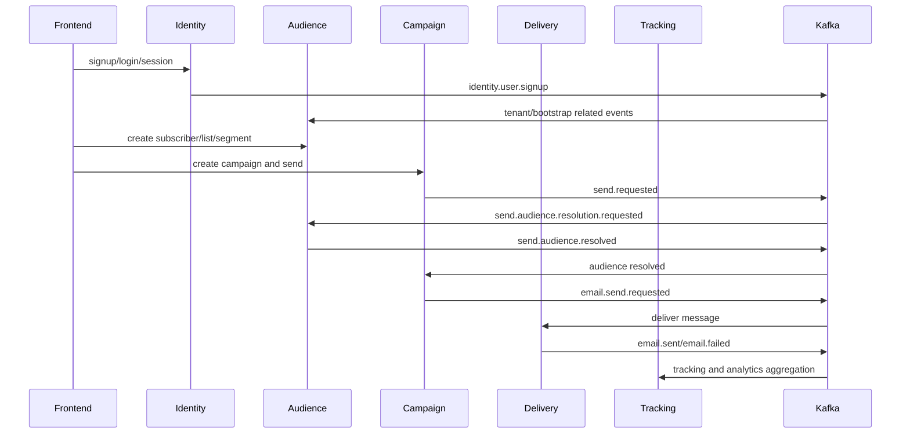

# Complete Master Documentation

## 1. Executive Summary

Legent Email Studio is a full-stack email operations system. It unifies marketing site, workspace onboarding, identity, audience data, email content, campaign governance, delivery execution, tracking analytics, automation journeys, deliverability posture, admin controls, and platform services.

The codebase contains 50717 inspected files. Key stacks are Java 21, Spring Boot 3.2, Maven, PostgreSQL, Redis, Kafka, ClickHouse, OpenSearch, MinIO, Docker Compose, Kubernetes, Next.js 15, React 19, Tailwind CSS, Zustand, Axios, and Playwright.

## 2. Product Capabilities

- Public website: homepage, features, modules, pricing, blog, contact, auth pages.
- Identity: signup, login, sessions, tenant/workspace context, onboarding.
- Audience Studio: subscribers, lists, segments, imports, data extensions, preferences, suppressions.
- Email Studio: templates, content blocks, assets, landing pages, approvals, versions, test sends.
- Campaign Studio: campaign creation, audience targeting, approval workflow, budgets, experiments, launch readiness, send jobs.
- Automation Studio: workflow definitions, graph v2 validation, simulation, triggers, schedules, runs.
- Delivery Studio: providers, provider health, routing decisions, queue stats, replay, safety evaluation, warmup.
- Deliverability: domains, SPF/DKIM/DMARC verification, reputation, spam scoring, suppression.
- Tracking and Analytics: opens, clicks, conversion events, campaign summaries, funnels, realtime websocket analytics.
- Admin and Platform: branding, runtime settings, users, RBAC, webhooks, notifications, search indexing.

## 3. Service Inventory

| Service | Port | Database | Controllers | Entities | Migrations | Responsibility |
| --- | --- | --- | --- | --- | --- | --- |
| audience-service | 8082 | ${DB_NAME:legent_audience | 9 | 12 | 13 | Subscribers, lists, segments, imports, consent, suppressions, preferences. |
| automation-service | 8086 | ${DB_NAME:legent_automation | 2 | 5 | 3 | Workflow definitions, graph validation, schedules, runs, simulations. |
| campaign-service | 8083 | ${DB_NAME:legent_campaign | 5 | 17 | 13 | Campaigns, audiences, approvals, experiments, budgets, frequency, send jobs. |
| content-service | 8090 | ${DB_NAME:legent_content | 8 | 14 | 7 | Email templates, content blocks, assets, landing pages, test sends, approvals. |
| deliverability-service | 8087 | ${DB_NAME:legent_deliverability | 5 | 6 | 7 | Sender domains, DNS verification, reputation, spam scoring, DMARC, suppression. |
| delivery-service | 8084 | ${DB_NAME:legent_delivery | 2 | 12 | 11 | Provider routing, queue operations, replay, warmup, rate limits, safety evaluation. |
| foundation-service | 8081 | ${DB_NAME:legent_foundation | 15 | 11 | 11 | Tenants, feature flags, branding, admin configuration, bootstrap, public content. |
| identity-service | 8089 | ${DB_NAME:legent_identity | 2 | 11 | 8 | Authentication, sessions, account membership, onboarding state, preferences. |
| platform-service | 8088 | ${DB_NAME:legent_platform | 4 | 6 | 4 | Notifications, webhooks, search indexing, tenant integration utilities. |
| tracking-service | 8085 | ${DB_NAME:legent_tracking | 4 | 3 | 7 | Open/click ingestion, analytics summaries, funnels, websocket analytics. |

## 4. Shared Libraries

| Shared Module | Java Files | Tests | Purpose |
| --- | --- | --- | --- |
| legent-cache | 3 | 2 | Redis cache utilities. |
| legent-common | 21 | 4 | Base entities, response wrappers, constants, exceptions. |
| legent-kafka | 7 | 1 | Kafka producer/consumer configuration and event envelopes. |
| legent-security | 11 | 4 | JWT, tenant/workspace context, RBAC, filters/interceptors. |
| legent-test-support | 2 | 0 | Integration test support and tenant test helpers. |

## 5. Frontend Structure

Frontend source lives under `frontend/src`. The app uses Next.js App Router, workspace layout reuse, shared UI components, API clients, auth/context bootstrap helpers, Zustand stores, and Playwright e2e tests.

### Public Routes

| Route | Source |
| --- | --- |
| /admin | frontend/src/app/(workspace)/admin/page.tsx |
| /analytics | frontend/src/app/(workspace)/analytics/page.tsx |
| /audience/data-extensions | frontend/src/app/(workspace)/audience/data-extensions/page.tsx |
| /audience/imports/:id | frontend/src/app/(workspace)/audience/imports/[id]/page.tsx |
| /audience/imports/new | frontend/src/app/(workspace)/audience/imports/new/page.tsx |
| /audience/imports | frontend/src/app/(workspace)/audience/imports/page.tsx |
| /audience/lists | frontend/src/app/(workspace)/audience/lists/page.tsx |
| /audience | frontend/src/app/(workspace)/audience/page.tsx |
| /audience/segments/:id | frontend/src/app/(workspace)/audience/segments/[id]/page.tsx |
| /audience/segments/new | frontend/src/app/(workspace)/audience/segments/new/page.tsx |
| /audience/segments | frontend/src/app/(workspace)/audience/segments/page.tsx |
| /audience/subscribers | frontend/src/app/(workspace)/audience/subscribers/page.tsx |
| /automation | frontend/src/app/(workspace)/automation/page.tsx |
| /automations/builder | frontend/src/app/(workspace)/automations/builder/page.tsx |
| /campaigns/:id/tracking | frontend/src/app/(workspace)/campaigns/[id]/tracking/page.tsx |
| /campaigns/new | frontend/src/app/(workspace)/campaigns/new/page.tsx |
| /campaigns | frontend/src/app/(workspace)/campaigns/page.tsx |
| /deliverability | frontend/src/app/(workspace)/deliverability/page.tsx |
| /email/landing-pages | frontend/src/app/(workspace)/email/landing-pages/page.tsx |
| /email | frontend/src/app/(workspace)/email/page.tsx |
| /email/templates/:id | frontend/src/app/(workspace)/email/templates/[id]/page.tsx |
| /email/templates | frontend/src/app/(workspace)/email/templates/page.tsx |
| /launch | frontend/src/app/(workspace)/launch/page.tsx |
| /settings/deliverability | frontend/src/app/(workspace)/settings/deliverability/page.tsx |
| /settings/platform | frontend/src/app/(workspace)/settings/platform/page.tsx |
| /tracking | frontend/src/app/(workspace)/tracking/page.tsx |
| /about | frontend/src/app/about/page.tsx |
| /blog/:slug | frontend/src/app/blog/[slug]/page.tsx |
| /blog | frontend/src/app/blog/page.tsx |
| /contact | frontend/src/app/contact/page.tsx |
| /features | frontend/src/app/features/page.tsx |
| /forgot-password | frontend/src/app/forgot-password/page.tsx |
| /login | frontend/src/app/login/page.tsx |
| /lp/:slug | frontend/src/app/lp/[slug]/page.tsx |
| /modules | frontend/src/app/modules/page.tsx |
| /onboarding | frontend/src/app/onboarding/page.tsx |
| / | frontend/src/app/page.tsx |
| /pricing | frontend/src/app/pricing/page.tsx |
| /reset-password | frontend/src/app/reset-password/page.tsx |
| /signup | frontend/src/app/signup/page.tsx |

### Authenticated Workspace Routes

| Route | Source |
| --- | --- |
| /app/admin | frontend/src/app/app/admin/page.tsx |
| /app/analytics | frontend/src/app/app/analytics/page.tsx |
| /app/audience/data-extensions | frontend/src/app/app/audience/data-extensions/page.tsx |
| /app/audience/imports/:id | frontend/src/app/app/audience/imports/[id]/page.tsx |
| /app/audience/imports/new | frontend/src/app/app/audience/imports/new/page.tsx |
| /app/audience/imports | frontend/src/app/app/audience/imports/page.tsx |
| /app/audience/lists | frontend/src/app/app/audience/lists/page.tsx |
| /app/audience | frontend/src/app/app/audience/page.tsx |
| /app/audience/segments/:id | frontend/src/app/app/audience/segments/[id]/page.tsx |
| /app/audience/segments/new | frontend/src/app/app/audience/segments/new/page.tsx |
| /app/audience/segments | frontend/src/app/app/audience/segments/page.tsx |
| /app/audience/subscribers | frontend/src/app/app/audience/subscribers/page.tsx |
| /app/automation | frontend/src/app/app/automation/page.tsx |
| /app/automations/builder | frontend/src/app/app/automations/builder/page.tsx |
| /app/campaigns/:id/tracking | frontend/src/app/app/campaigns/[id]/tracking/page.tsx |
| /app/campaigns/new | frontend/src/app/app/campaigns/new/page.tsx |
| /app/campaigns | frontend/src/app/app/campaigns/page.tsx |
| /app/deliverability | frontend/src/app/app/deliverability/page.tsx |
| /app/email/landing-pages | frontend/src/app/app/email/landing-pages/page.tsx |
| /app/email | frontend/src/app/app/email/page.tsx |
| /app/email/templates/:id | frontend/src/app/app/email/templates/[id]/page.tsx |
| /app/email/templates | frontend/src/app/app/email/templates/page.tsx |
| /app/launch | frontend/src/app/app/launch/page.tsx |
| /app | frontend/src/app/app/page.tsx |
| /app/settings/deliverability | frontend/src/app/app/settings/deliverability/page.tsx |
| /app/settings/platform | frontend/src/app/app/settings/platform/page.tsx |
| /app/tracking | frontend/src/app/app/tracking/page.tsx |

## 6. API Catalog Summary

| Service | Method | Path | Handler | Source |
| --- | --- | --- | --- | --- |
| audience-service | GET | / | list | services/audience-service/src/main/java/com/legent/audience/controller/DataExtensionController.java |
| audience-service | GET | /{id} | getById | services/audience-service/src/main/java/com/legent/audience/controller/DataExtensionController.java |
| audience-service | POST | / | create | services/audience-service/src/main/java/com/legent/audience/controller/DataExtensionController.java |
| audience-service | DELETE | /{id} | delete | services/audience-service/src/main/java/com/legent/audience/controller/DataExtensionController.java |
| audience-service | POST | /{deId}/records | addRecord | services/audience-service/src/main/java/com/legent/audience/controller/DataExtensionController.java |
| audience-service | GET | /{deId}/records | listRecords | services/audience-service/src/main/java/com/legent/audience/controller/DataExtensionController.java |
| audience-service | POST | / | uploadImport | services/audience-service/src/main/java/com/legent/audience/controller/ImportController.java |
| audience-service | GET | /{id} | getStatus | services/audience-service/src/main/java/com/legent/audience/controller/ImportController.java |
| audience-service | GET | / | listImports | services/audience-service/src/main/java/com/legent/audience/controller/ImportController.java |
| audience-service | POST | /{id}/cancel | cancelImport | services/audience-service/src/main/java/com/legent/audience/controller/ImportController.java |
| audience-service | POST | /mock | startImport | services/audience-service/src/main/java/com/legent/audience/controller/LocalImportController.java |
| audience-service | GET | /{subscriberId} | get | services/audience-service/src/main/java/com/legent/audience/controller/PreferenceController.java |
| audience-service | PUT | /{subscriberId} | update | services/audience-service/src/main/java/com/legent/audience/controller/PreferenceController.java |
| audience-service | POST | /{subscriberId}/pause | pause | services/audience-service/src/main/java/com/legent/audience/controller/PreferenceController.java |
| audience-service | POST | /{subscriberId}/unsubscribe | unsubscribe | services/audience-service/src/main/java/com/legent/audience/controller/PreferenceController.java |
| audience-service | POST | /{subscriberId}/resubscribe | resubscribe | services/audience-service/src/main/java/com/legent/audience/controller/PreferenceController.java |
| audience-service | GET | / | list | services/audience-service/src/main/java/com/legent/audience/controller/SegmentController.java |
| audience-service | GET | /{id} | getById | services/audience-service/src/main/java/com/legent/audience/controller/SegmentController.java |
| audience-service | POST | / | create | services/audience-service/src/main/java/com/legent/audience/controller/SegmentController.java |
| audience-service | PUT | /{id} | update | services/audience-service/src/main/java/com/legent/audience/controller/SegmentController.java |
| audience-service | DELETE | /{id} | delete | services/audience-service/src/main/java/com/legent/audience/controller/SegmentController.java |
| audience-service | GET | /{id}/evaluate | evaluate | services/audience-service/src/main/java/com/legent/audience/controller/SegmentController.java |
| audience-service | POST | /{id}/recompute | recompute | services/audience-service/src/main/java/com/legent/audience/controller/SegmentController.java |
| audience-service | POST | /send-eligibility | check | services/audience-service/src/main/java/com/legent/audience/controller/SendEligibilityController.java |
| audience-service | GET | / | list | services/audience-service/src/main/java/com/legent/audience/controller/SubscriberController.java |
| audience-service | GET | /{id} | getById | services/audience-service/src/main/java/com/legent/audience/controller/SubscriberController.java |
| audience-service | GET | /key/{subscriberKey} | getByKey | services/audience-service/src/main/java/com/legent/audience/controller/SubscriberController.java |
| audience-service | POST | / | create | services/audience-service/src/main/java/com/legent/audience/controller/SubscriberController.java |
| audience-service | PUT | /{id} | update | services/audience-service/src/main/java/com/legent/audience/controller/SubscriberController.java |
| audience-service | DELETE | /{id} | delete | services/audience-service/src/main/java/com/legent/audience/controller/SubscriberController.java |
| audience-service | POST | /bulk | bulkUpsert | services/audience-service/src/main/java/com/legent/audience/controller/SubscriberController.java |
| audience-service | POST | /merge | merge | services/audience-service/src/main/java/com/legent/audience/controller/SubscriberController.java |
| audience-service | POST | /bulk-actions | bulkActions | services/audience-service/src/main/java/com/legent/audience/controller/SubscriberController.java |
| audience-service | PUT | /{id}/lifecycle | updateLifecycle | services/audience-service/src/main/java/com/legent/audience/controller/SubscriberController.java |
| audience-service | PUT | /{id}/score | updateScore | services/audience-service/src/main/java/com/legent/audience/controller/SubscriberController.java |
| audience-service | GET | /{id}/activity | activity | services/audience-service/src/main/java/com/legent/audience/controller/SubscriberController.java |
| audience-service | GET | /count | count | services/audience-service/src/main/java/com/legent/audience/controller/SubscriberController.java |
| audience-service | GET | / | list | services/audience-service/src/main/java/com/legent/audience/controller/SubscriberListController.java |
| audience-service | GET | /{id} | getById | services/audience-service/src/main/java/com/legent/audience/controller/SubscriberListController.java |
| audience-service | POST | / | create | services/audience-service/src/main/java/com/legent/audience/controller/SubscriberListController.java |
| audience-service | PUT | /{id} | update | services/audience-service/src/main/java/com/legent/audience/controller/SubscriberListController.java |
| audience-service | DELETE | /{id} | delete | services/audience-service/src/main/java/com/legent/audience/controller/SubscriberListController.java |
| audience-service | POST | /{id}/members | addMembers | services/audience-service/src/main/java/com/legent/audience/controller/SubscriberListController.java |
| audience-service | DELETE | /{id}/members | removeMembers | services/audience-service/src/main/java/com/legent/audience/controller/SubscriberListController.java |
| audience-service | GET | / | list | services/audience-service/src/main/java/com/legent/audience/controller/SuppressionController.java |
| audience-service | POST | / | create | services/audience-service/src/main/java/com/legent/audience/controller/SuppressionController.java |
| audience-service | POST | /bulk | bulkCreate | services/audience-service/src/main/java/com/legent/audience/controller/SuppressionController.java |
| audience-service | GET | /check/{email} | checkCompliance | services/audience-service/src/main/java/com/legent/audience/controller/SuppressionController.java |
| audience-service | DELETE | /{id} | delete | services/audience-service/src/main/java/com/legent/audience/controller/SuppressionController.java |
| automation-service | GET | / | listWorkflows | services/automation-service/src/main/java/com/legent/automation/controller/WorkflowController.java |
| automation-service | POST | / | createWorkflow | services/automation-service/src/main/java/com/legent/automation/controller/WorkflowController.java |
| automation-service | GET | /{id} | getWorkflow | services/automation-service/src/main/java/com/legent/automation/controller/WorkflowController.java |
| automation-service | PUT | /{id} | updateWorkflow | services/automation-service/src/main/java/com/legent/automation/controller/WorkflowController.java |
| automation-service | POST | /{id}/validate | validateWorkflow | services/automation-service/src/main/java/com/legent/automation/controller/WorkflowController.java |
| automation-service | POST | /{id}/definitions | saveWorkflowDefinition | services/automation-service/src/main/java/com/legent/automation/controller/WorkflowController.java |
| automation-service | POST | /{id}/publish | publishWorkflow | services/automation-service/src/main/java/com/legent/automation/controller/WorkflowController.java |
| automation-service | POST | /{id}/pause | pauseWorkflow | services/automation-service/src/main/java/com/legent/automation/controller/WorkflowController.java |
| automation-service | POST | /{id}/resume | resumeWorkflow | services/automation-service/src/main/java/com/legent/automation/controller/WorkflowController.java |
| automation-service | POST | /{id}/stop | stopWorkflow | services/automation-service/src/main/java/com/legent/automation/controller/WorkflowController.java |
| automation-service | POST | /{id}/archive | archiveWorkflow | services/automation-service/src/main/java/com/legent/automation/controller/WorkflowController.java |
| automation-service | POST | /{id}/rollback | rollbackWorkflow | services/automation-service/src/main/java/com/legent/automation/controller/WorkflowController.java |
| automation-service | POST | /{id}/clone | cloneWorkflow | services/automation-service/src/main/java/com/legent/automation/controller/WorkflowController.java |
| automation-service | GET | /{id}/versions | listWorkflowVersions | services/automation-service/src/main/java/com/legent/automation/controller/WorkflowController.java |
| automation-service | GET | /{id}/versions/{version} | getWorkflowVersion | services/automation-service/src/main/java/com/legent/automation/controller/WorkflowController.java |
| automation-service | POST | /{id}/compare | compareVersions | services/automation-service/src/main/java/com/legent/automation/controller/WorkflowController.java |
| automation-service | POST | /{id}/trigger | triggerWorkflow | services/automation-service/src/main/java/com/legent/automation/controller/WorkflowController.java |
| automation-service | GET | /{id}/runs | listWorkflowRuns | services/automation-service/src/main/java/com/legent/automation/controller/WorkflowController.java |
| automation-service | GET | /runs/{runId} | getRun | services/automation-service/src/main/java/com/legent/automation/controller/WorkflowController.java |
| automation-service | GET | /runs/{runId}/steps | getRunSteps | services/automation-service/src/main/java/com/legent/automation/controller/WorkflowController.java |
| automation-service | GET | /runs/{runId}/trace | getRunTrace | services/automation-service/src/main/java/com/legent/automation/controller/WorkflowController.java |
| automation-service | POST | /{id}/simulate | simulate | services/automation-service/src/main/java/com/legent/automation/controller/WorkflowController.java |
| automation-service | POST | /{id}/dry-run | dryRun | services/automation-service/src/main/java/com/legent/automation/controller/WorkflowController.java |
| automation-service | GET | /{id}/schedules | listSchedules | services/automation-service/src/main/java/com/legent/automation/controller/WorkflowController.java |
| automation-service | POST | /{id}/schedules | createSchedule | services/automation-service/src/main/java/com/legent/automation/controller/WorkflowController.java |
| automation-service | PUT | /{id}/schedules/{scheduleId} | updateSchedule | services/automation-service/src/main/java/com/legent/automation/controller/WorkflowController.java |
| automation-service | DELETE | /{id}/schedules/{scheduleId} | deleteSchedule | services/automation-service/src/main/java/com/legent/automation/controller/WorkflowController.java |
| automation-service | GET | /{workflowId}/latest | getLatestDefinition | services/automation-service/src/main/java/com/legent/automation/controller/WorkflowDefinitionController.java |
| automation-service | POST | / | saveDefinition | services/automation-service/src/main/java/com/legent/automation/controller/WorkflowDefinitionController.java |
| automation-service | GET | /{workflowId}/versions/{version} | getDefinitionVersion | services/automation-service/src/main/java/com/legent/automation/controller/WorkflowDefinitionController.java |
| campaign-service | GET | /api/v1/campaignshasAnyRole('ADMIN', 'CAMPAIGN_MANAGER', 'ANALYST', 'VIEWER') | list | services/campaign-service/src/main/java/com/legent/campaign/controller/CampaignController.java |
| campaign-service | GET | /api/v1/campaignshasAnyRole('ADMIN', 'CAMPAIGN_MANAGER', 'ANALYST', 'VIEWER')/{id} | getById | services/campaign-service/src/main/java/com/legent/campaign/controller/CampaignController.java |
| campaign-service | POST | /api/v1/campaignshasAnyRole('ADMIN', 'CAMPAIGN_MANAGER', 'ANALYST', 'VIEWER') | create | services/campaign-service/src/main/java/com/legent/campaign/controller/CampaignController.java |
| campaign-service | PUT | /api/v1/campaignshasAnyRole('ADMIN', 'CAMPAIGN_MANAGER', 'ANALYST', 'VIEWER')/{id} | update | services/campaign-service/src/main/java/com/legent/campaign/controller/CampaignController.java |
| campaign-service | DELETE | /api/v1/campaignshasAnyRole('ADMIN', 'CAMPAIGN_MANAGER', 'ANALYST', 'VIEWER')/{id} | delete | services/campaign-service/src/main/java/com/legent/campaign/controller/CampaignController.java |
| campaign-service | POST | /api/v1/campaignshasAnyRole('ADMIN', 'CAMPAIGN_MANAGER', 'ANALYST', 'VIEWER')/{id}/clone | cloneCampaign | services/campaign-service/src/main/java/com/legent/campaign/controller/CampaignController.java |
| campaign-service | POST | /api/v1/campaignshasAnyRole('ADMIN', 'CAMPAIGN_MANAGER', 'ANALYST', 'VIEWER')/{id}/archive | archive | services/campaign-service/src/main/java/com/legent/campaign/controller/CampaignController.java |
| campaign-service | POST | /api/v1/campaignshasAnyRole('ADMIN', 'CAMPAIGN_MANAGER', 'ANALYST', 'VIEWER')/{id}/restore | restore | services/campaign-service/src/main/java/com/legent/campaign/controller/CampaignController.java |
| campaign-service | POST | /api/v1/campaignshasAnyRole('ADMIN', 'CAMPAIGN_MANAGER', 'ANALYST', 'VIEWER')/{id}/pause | pause | services/campaign-service/src/main/java/com/legent/campaign/controller/CampaignController.java |
| campaign-service | POST | /api/v1/campaignshasAnyRole('ADMIN', 'CAMPAIGN_MANAGER', 'ANALYST', 'VIEWER')/{id}/resume | resume | services/campaign-service/src/main/java/com/legent/campaign/controller/CampaignController.java |
| campaign-service | POST | /api/v1/campaignshasAnyRole('ADMIN', 'CAMPAIGN_MANAGER', 'ANALYST', 'VIEWER')/{id}/cancel | cancel | services/campaign-service/src/main/java/com/legent/campaign/controller/CampaignController.java |
| campaign-service | POST | /api/v1/campaignshasAnyRole('ADMIN', 'CAMPAIGN_MANAGER', 'ANALYST', 'VIEWER')/{id}/schedule | schedule | services/campaign-service/src/main/java/com/legent/campaign/controller/CampaignController.java |
| campaign-service | GET | /campaigns/{id}/experiments | listExperiments | services/campaign-service/src/main/java/com/legent/campaign/controller/CampaignEngineController.java |
| campaign-service | POST | /campaigns/{id}/experiments | createExperiment | services/campaign-service/src/main/java/com/legent/campaign/controller/CampaignEngineController.java |
| campaign-service | PUT | /campaigns/{id}/experiments/{experimentId} | updateExperiment | services/campaign-service/src/main/java/com/legent/campaign/controller/CampaignEngineController.java |
| campaign-service | DELETE | /campaigns/{id}/experiments/{experimentId} | deleteExperiment | services/campaign-service/src/main/java/com/legent/campaign/controller/CampaignEngineController.java |
| campaign-service | POST | /campaigns/{id}/experiments/{experimentId}/promote-winner | promoteWinner | services/campaign-service/src/main/java/com/legent/campaign/controller/CampaignEngineController.java |
| campaign-service | GET | /campaigns/{id}/experiments/{experimentId}/metrics | getExperimentMetrics | services/campaign-service/src/main/java/com/legent/campaign/controller/CampaignEngineController.java |
| campaign-service | GET | /campaigns/{id}/budget | getBudget | services/campaign-service/src/main/java/com/legent/campaign/controller/CampaignEngineController.java |
| campaign-service | PUT | /campaigns/{id}/budget | updateBudget | services/campaign-service/src/main/java/com/legent/campaign/controller/CampaignEngineController.java |
| campaign-service | GET | /campaigns/{id}/frequency-policy | getFrequencyPolicy | services/campaign-service/src/main/java/com/legent/campaign/controller/CampaignEngineController.java |
| campaign-service | PUT | /campaigns/{id}/frequency-policy | updateFrequencyPolicy | services/campaign-service/src/main/java/com/legent/campaign/controller/CampaignEngineController.java |
| campaign-service | POST | /campaigns/{id}/send/preflight | preflight | services/campaign-service/src/main/java/com/legent/campaign/controller/CampaignEngineController.java |
| campaign-service | POST | /campaigns/{id}/send/resend-plans | createResendPlan | services/campaign-service/src/main/java/com/legent/campaign/controller/CampaignEngineController.java |
| campaign-service | GET | /send-jobs/{jobId}/dead-letters | listDeadLetters | services/campaign-service/src/main/java/com/legent/campaign/controller/CampaignEngineController.java |
| campaign-service | POST | /send-jobs/{jobId}/dead-letters/{deadLetterId}/replay | replayDeadLetter | services/campaign-service/src/main/java/com/legent/campaign/controller/CampaignEngineController.java |
| campaign-service | POST | /launch-plans/preview | preview | services/campaign-service/src/main/java/com/legent/campaign/controller/CampaignLaunchController.java |
| campaign-service | POST | /launch-plans/execute | execute | services/campaign-service/src/main/java/com/legent/campaign/controller/CampaignLaunchController.java |
| campaign-service | GET | /{campaignId}/launch-readiness | readiness | services/campaign-service/src/main/java/com/legent/campaign/controller/CampaignLaunchController.java |
| campaign-service | POST | /{campaignId}/submit-approval | submitForApproval | services/campaign-service/src/main/java/com/legent/campaign/controller/CampaignWorkflowController.java |
| campaign-service | GET | /{campaignId}/approvals | approvalHistory | services/campaign-service/src/main/java/com/legent/campaign/controller/CampaignWorkflowController.java |
| campaign-service | GET | /approvals/pending | pendingApprovals | services/campaign-service/src/main/java/com/legent/campaign/controller/CampaignWorkflowController.java |
| campaign-service | POST | /approvals/{approvalId}/approve | approve | services/campaign-service/src/main/java/com/legent/campaign/controller/CampaignWorkflowController.java |
| campaign-service | POST | /approvals/{approvalId}/reject | reject | services/campaign-service/src/main/java/com/legent/campaign/controller/CampaignWorkflowController.java |
| campaign-service | POST | /approvals/{approvalId}/cancel | cancel | services/campaign-service/src/main/java/com/legent/campaign/controller/CampaignWorkflowController.java |
| campaign-service | POST | /campaigns/{id}/send | triggerSend | services/campaign-service/src/main/java/com/legent/campaign/controller/SendJobController.java |
| campaign-service | GET | /campaigns/{id}/jobs | getJobsForCampaign | services/campaign-service/src/main/java/com/legent/campaign/controller/SendJobController.java |
| campaign-service | GET | /send-jobs/{jobId} | getJobStatus | services/campaign-service/src/main/java/com/legent/campaign/controller/SendJobController.java |
| campaign-service | POST | /campaigns/{id}/send/pause | pause | services/campaign-service/src/main/java/com/legent/campaign/controller/SendJobController.java |
| campaign-service | POST | /campaigns/{id}/send/resume | resume | services/campaign-service/src/main/java/com/legent/campaign/controller/SendJobController.java |
| campaign-service | POST | /campaigns/{id}/send/cancel | cancel | services/campaign-service/src/main/java/com/legent/campaign/controller/SendJobController.java |
| campaign-service | POST | /send-jobs/{jobId}/retry | retry | services/campaign-service/src/main/java/com/legent/campaign/controller/SendJobController.java |
| campaign-service | POST | /campaigns/{id}/send/resend | resend | services/campaign-service/src/main/java/com/legent/campaign/controller/SendJobController.java |
| campaign-service | POST | /campaigns/{id}/trigger-launch | triggerLaunch | services/campaign-service/src/main/java/com/legent/campaign/controller/SendJobController.java |
| content-service | GET | / | listAssets | services/content-service/src/main/java/com/legent/content/controller/AssetController.java |
| content-service | POST | / | uploadAsset | services/content-service/src/main/java/com/legent/content/controller/AssetController.java |
| content-service | POST | /bulk | bulkUpload | services/content-service/src/main/java/com/legent/content/controller/AssetController.java |
| content-service | DELETE | /{id} | deleteAsset | services/content-service/src/main/java/com/legent/content/controller/AssetController.java |
| content-service | POST | / | createBlock | services/content-service/src/main/java/com/legent/content/controller/ContentBlockController.java |
| content-service | GET | /{id} | getBlock | services/content-service/src/main/java/com/legent/content/controller/ContentBlockController.java |
| content-service | PUT | /{id} | updateBlock | services/content-service/src/main/java/com/legent/content/controller/ContentBlockController.java |
| content-service | DELETE | /{id} | deleteBlock | services/content-service/src/main/java/com/legent/content/controller/ContentBlockController.java |
| content-service | GET | / | listBlocks | services/content-service/src/main/java/com/legent/content/controller/ContentBlockController.java |
| content-service | GET | /global | listGlobalBlocks | services/content-service/src/main/java/com/legent/content/controller/ContentBlockController.java |
| content-service | POST | /{id}/versions | createVersion | services/content-service/src/main/java/com/legent/content/controller/ContentBlockController.java |
| content-service | GET | /{id}/versions | listVersions | services/content-service/src/main/java/com/legent/content/controller/ContentBlockController.java |
| content-service | POST | /{id}/versions/{versionNumber}/publish | publishVersion | services/content-service/src/main/java/com/legent/content/controller/ContentBlockController.java |
| content-service | POST | /{id}/rollback/{versionNumber} | rollbackVersion | services/content-service/src/main/java/com/legent/content/controller/ContentBlockController.java |
| content-service | POST | /{templateId}/render | renderTemplate | services/content-service/src/main/java/com/legent/content/controller/ContentController.java |
| content-service | GET | /{templateId}/versions/latest | getLatestVersion | services/content-service/src/main/java/com/legent/content/controller/ContentController.java |
| content-service | POST | / | createEmail | services/content-service/src/main/java/com/legent/content/controller/EmailController.java |

## 7. Database And Migration Summary

| Service | Count | Migrations |
| --- | --- | --- |
| audience-service | 26 | V10__add_created_at_to_list_memberships.sql V11__add_created_at_to_segment_memberships.sql V12__add_updated_at_to_suppressions.sql V13__workspace_scope_and_idempotency.sql V1__audience_schema.sql V2__consent_and_double_optin.sql V3__add_deleted_at_to_consent_records.sql V4__add_version_to_consent_records.sql V5__add_created_by_to_data_extension_fields.sql V6__add_base_entity_columns_to_all_tables.sql V7__add_updated_at_to_all_tables.sql V8__add_created_by_to_all_tables.sql V9__add_all_base_entity_to_data_extension_records.sql V10__add_created_at_to_list_memberships.sql V11__add_created_at_to_segment_memberships.sql V12__add_updated_at_to_suppressions.sql V13__workspace_scope_and_idempotency.sql V1__audience_schema.sql V2__consent_and_double_optin.sql V3__add_deleted_at_to_consent_records.sql V4__add_version_to_consent_records.sql V5__add_created_by_to_data_extension_fields.sql V6__add_base_entity_columns_to_all_tables.sql V7__add_updated_at_to_all_tables.sql V8__add_created_by_to_all_tables.sql V9__add_all_base_entity_to_data_extension_records.sql |
| automation-service | 6 | V1__automation_schema.sql V3__fix_workflow_version_datatype.sql V4__automation_workspace_scope_and_idempotency.sql V1__automation_schema.sql V3__fix_workflow_version_datatype.sql V4__automation_workspace_scope_and_idempotency.sql |
| campaign-service | 26 | V10__add_all_base_entity_columns_to_send_job_checkpoints.sql V11__campaign_workspace_lifecycle_and_idempotency.sql V12__campaign_engine_enterprise.sql V13__campaign_launch_command_center.sql V1__campaign_schema.sql V2__campaign_approval_and_checkpoint.sql V3__add_content_id_to_campaigns.sql V4__add_missing_columns.sql V5__add_scheduled_at_to_campaigns.sql V6__add_missing_send_batches_columns.sql V7__add_created_by_to_send_job_checkpoints.sql V8__add_deleted_at_to_send_job_checkpoints.sql V9__add_updated_at_to_send_job_checkpoints.sql V10__add_all_base_entity_columns_to_send_job_checkpoints.sql V11__campaign_workspace_lifecycle_and_idempotency.sql V12__campaign_engine_enterprise.sql V13__campaign_launch_command_center.sql V1__campaign_schema.sql V2__campaign_approval_and_checkpoint.sql V3__add_content_id_to_campaigns.sql V4__add_missing_columns.sql V5__add_scheduled_at_to_campaigns.sql V6__add_missing_send_batches_columns.sql V7__add_created_by_to_send_job_checkpoints.sql V8__add_deleted_at_to_send_job_checkpoints.sql V9__add_updated_at_to_send_job_checkpoints.sql |
| content-service | 14 | V1__content_schema.sql V2__template_workflow.sql V3__add_created_by_to_template_approvals.sql V4__add_deleted_at_and_version_to_template_approvals.sql V5__add_base_entity_columns_to_template_versions.sql V6__add_updated_at_to_template_versions.sql V7__email_studio_enterprise.sql V1__content_schema.sql V2__template_workflow.sql V3__add_created_by_to_template_approvals.sql V4__add_deleted_at_and_version_to_template_approvals.sql V5__add_base_entity_columns_to_template_versions.sql V6__add_updated_at_to_template_versions.sql V7__email_studio_enterprise.sql |
| deliverability-service | 14 | V1__deliverability_schema.sql V2__dmarc_reporting.sql V3__add_domain_status.sql V4__add_created_by_to_sender_domains.sql V5__add_deleted_at_and_version_to_sender_domains.sql V6__add_missing_sender_domain_columns.sql V7__workspace_scope_and_event_idempotency.sql V1__deliverability_schema.sql V2__dmarc_reporting.sql V3__add_domain_status.sql V4__add_created_by_to_sender_domains.sql V5__add_deleted_at_and_version_to_sender_domains.sql V6__add_missing_sender_domain_columns.sql V7__workspace_scope_and_event_idempotency.sql |
| delivery-service | 22 | V10__inbox_first_delivery_intelligence.sql V11__campaign_experiment_lineage.sql V1__delivery_schema.sql V2__encrypt_provider_passwords.sql V3__provider_health_and_replay.sql V4__fix_message_logs_audit_fields.sql V5__add_content_reference_to_message_logs.sql V6__fix_provider_health_audit_fields.sql V7__fix_suppression_signals_audit_fields.sql V8__message_logs_campaign_reconciliation.sql V9__workspace_strict_idempotency_and_lineage.sql V10__inbox_first_delivery_intelligence.sql V11__campaign_experiment_lineage.sql V1__delivery_schema.sql V2__encrypt_provider_passwords.sql V3__provider_health_and_replay.sql V4__fix_message_logs_audit_fields.sql V5__add_content_reference_to_message_logs.sql V6__fix_provider_health_audit_fields.sql V7__fix_suppression_signals_audit_fields.sql V8__message_logs_campaign_reconciliation.sql V9__workspace_strict_idempotency_and_lineage.sql |
| foundation-service | 22 | V10__admin_operations_sync_events.sql V11__widen_platform_core_tenant_ids.sql V1__foundation_schema.sql V2__admin_schema.sql V3__initial_data.sql V4__tenant_audit_and_config_versioning.sql V5__add_config_version_to_system_configs.sql V6__platform_core_foundation.sql V7__admin_settings_engine_and_bootstrap.sql V8__public_content_cms.sql V9__public_contact_requests.sql V10__admin_operations_sync_events.sql V11__widen_platform_core_tenant_ids.sql V1__foundation_schema.sql V2__admin_schema.sql V3__initial_data.sql V4__tenant_audit_and_config_versioning.sql V5__add_config_version_to_system_configs.sql V6__platform_core_foundation.sql V7__admin_settings_engine_and_bootstrap.sql V8__public_content_cms.sql V9__public_contact_requests.sql |
| identity-service | 16 | V1__identity_schema.sql V3__identity_constraints.sql V4__add_base_entity_columns_to_users.sql V5__initial_data.sql V6__add_refresh_tokens.sql V7__platform_core_identity_bridge.sql V8__widen_identity_bridge_ids.sql V9__auth_recovery_onboarding_and_preferences.sql V1__identity_schema.sql V3__identity_constraints.sql V4__add_base_entity_columns_to_users.sql V5__initial_data.sql V6__add_refresh_tokens.sql V7__platform_core_identity_bridge.sql V8__widen_identity_bridge_ids.sql V9__auth_recovery_onboarding_and_preferences.sql |
| platform-service | 8 | V1__platform_schema.sql V2__platform_webhooks_soft_delete.sql V3__add_webhook_retries_table.sql V4__add_webhook_retries_fk.sql V1__platform_schema.sql V2__platform_webhooks_soft_delete.sql V3__add_webhook_retries_table.sql V4__add_webhook_retries_fk.sql |
| tracking-service | 14 | V1__tracking_schema.sql V3__tracking_hardening.sql V4__tracking_hourly_agg.sql V5__enhanced_tracking.sql V6__add_created_at_to_subscriber_summaries.sql V7__tracking_workspace_and_idempotency.sql V8__campaign_experiment_lineage.sql V1__tracking_schema.sql V3__tracking_hardening.sql V4__tracking_hourly_agg.sql V5__enhanced_tracking.sql V6__add_created_at_to_subscriber_summaries.sql V7__tracking_workspace_and_idempotency.sql V8__campaign_experiment_lineage.sql |

## 8. Domain Entity Summary

| Service | Entity | Table | Source |
| --- | --- | --- | --- |
| audience-service | ConsentRecord | consent_records | services/audience-service/src/main/java/com/legent/audience/domain/ConsentRecord.java |
| audience-service | DataExtension | data_extensions | services/audience-service/src/main/java/com/legent/audience/domain/DataExtension.java |
| audience-service | DataExtensionField | data_extension_fields | services/audience-service/src/main/java/com/legent/audience/domain/DataExtensionField.java |
| audience-service | DataExtensionRecord | data_extension_records | services/audience-service/src/main/java/com/legent/audience/domain/DataExtensionRecord.java |
| audience-service | DoubleOptInToken | double_optin_tokens | services/audience-service/src/main/java/com/legent/audience/domain/DoubleOptInToken.java |
| audience-service | ImportJob | import_jobs | services/audience-service/src/main/java/com/legent/audience/domain/ImportJob.java |
| audience-service | ListMembership | list_memberships | services/audience-service/src/main/java/com/legent/audience/domain/ListMembership.java |
| audience-service | Segment | segments | services/audience-service/src/main/java/com/legent/audience/domain/Segment.java |
| audience-service | SegmentMembership | segment_memberships | services/audience-service/src/main/java/com/legent/audience/domain/SegmentMembership.java |
| audience-service | Subscriber | subscribers | services/audience-service/src/main/java/com/legent/audience/domain/Subscriber.java |
| audience-service | SubscriberList | subscriber_lists | services/audience-service/src/main/java/com/legent/audience/domain/SubscriberList.java |
| audience-service | Suppression | suppressions | services/audience-service/src/main/java/com/legent/audience/domain/Suppression.java |
| automation-service | InstanceHistory | instance_history | services/automation-service/src/main/java/com/legent/automation/domain/InstanceHistory.java |
| automation-service | Workflow | workflows | services/automation-service/src/main/java/com/legent/automation/domain/Workflow.java |
| automation-service | WorkflowDefinition | workflow_definitions | services/automation-service/src/main/java/com/legent/automation/domain/WorkflowDefinition.java |
| automation-service | WorkflowInstance | workflow_instances | services/automation-service/src/main/java/com/legent/automation/domain/WorkflowInstance.java |
| automation-service | WorkflowSchedule | workflow_schedules | services/automation-service/src/main/java/com/legent/automation/domain/WorkflowSchedule.java |
| campaign-service | Campaign | campaigns | services/campaign-service/src/main/java/com/legent/campaign/domain/Campaign.java |
| campaign-service | CampaignApproval | campaign_approvals | services/campaign-service/src/main/java/com/legent/campaign/domain/CampaignApproval.java |
| campaign-service | CampaignAudience | campaign_audiences | services/campaign-service/src/main/java/com/legent/campaign/domain/CampaignAudience.java |
| campaign-service | CampaignBudget | campaign_budgets | services/campaign-service/src/main/java/com/legent/campaign/domain/CampaignBudget.java |
| campaign-service | CampaignDeadLetter | campaign_dead_letters | services/campaign-service/src/main/java/com/legent/campaign/domain/CampaignDeadLetter.java |
| campaign-service | CampaignExperiment | campaign_experiments | services/campaign-service/src/main/java/com/legent/campaign/domain/CampaignExperiment.java |
| campaign-service | CampaignFrequencyPolicy | campaign_frequency_policies | services/campaign-service/src/main/java/com/legent/campaign/domain/CampaignFrequencyPolicy.java |
| campaign-service | CampaignLaunchPlan | campaign_launch_plans | services/campaign-service/src/main/java/com/legent/campaign/domain/CampaignLaunchPlan.java |
| campaign-service | CampaignLaunchStep | campaign_launch_steps | services/campaign-service/src/main/java/com/legent/campaign/domain/CampaignLaunchStep.java |
| campaign-service | CampaignLock | campaign_locks | services/campaign-service/src/main/java/com/legent/campaign/domain/CampaignLock.java |
| campaign-service | CampaignSendLedger | campaign_send_ledger | services/campaign-service/src/main/java/com/legent/campaign/domain/CampaignSendLedger.java |
| campaign-service | CampaignVariant | campaign_variants | services/campaign-service/src/main/java/com/legent/campaign/domain/CampaignVariant.java |
| campaign-service | CampaignVariantMetric | campaign_variant_metrics | services/campaign-service/src/main/java/com/legent/campaign/domain/CampaignVariantMetric.java |
| campaign-service | SendBatch | send_batches | services/campaign-service/src/main/java/com/legent/campaign/domain/SendBatch.java |
| campaign-service | SendJob | send_jobs | services/campaign-service/src/main/java/com/legent/campaign/domain/SendJob.java |
| campaign-service | SendJobCheckpoint | send_job_checkpoints | services/campaign-service/src/main/java/com/legent/campaign/domain/SendJobCheckpoint.java |
| campaign-service | ThrottlingRule | throttling_rules | services/campaign-service/src/main/java/com/legent/campaign/domain/ThrottlingRule.java |
| content-service | Asset | assets | services/content-service/src/main/java/com/legent/content/domain/Asset.java |
| content-service | BrandKit | brand_kits | services/content-service/src/main/java/com/legent/content/domain/BrandKit.java |
| content-service | ContentBlock | content_blocks | services/content-service/src/main/java/com/legent/content/domain/ContentBlock.java |
| content-service | ContentBlockVersion | content_block_versions | services/content-service/src/main/java/com/legent/content/domain/ContentBlockVersion.java |
| content-service | ContentSnippet | content_snippets | services/content-service/src/main/java/com/legent/content/domain/ContentSnippet.java |
| content-service | DynamicContentRule | dynamic_content_rules | services/content-service/src/main/java/com/legent/content/domain/DynamicContentRule.java |
| content-service | Email | emails | services/content-service/src/main/java/com/legent/content/domain/Email.java |
| content-service | EmailTemplate | email_templates | services/content-service/src/main/java/com/legent/content/domain/EmailTemplate.java |
| content-service | LandingPage | landing_pages | services/content-service/src/main/java/com/legent/content/domain/LandingPage.java |
| content-service | PersonalizationToken | personalization_tokens | services/content-service/src/main/java/com/legent/content/domain/PersonalizationToken.java |
| content-service | RenderValidationReport | render_validation_reports | services/content-service/src/main/java/com/legent/content/domain/RenderValidationReport.java |
| content-service | TemplateApproval | template_approvals | services/content-service/src/main/java/com/legent/content/domain/TemplateApproval.java |
| content-service | TemplateTestSendRecord | template_test_send_records | services/content-service/src/main/java/com/legent/content/domain/TemplateTestSendRecord.java |
| content-service | TemplateVersion | template_versions | services/content-service/src/main/java/com/legent/content/domain/TemplateVersion.java |
| deliverability-service | DmarcReport | dmarc_reports | services/deliverability-service/src/main/java/com/legent/deliverability/domain/DmarcReport.java |
| deliverability-service | DomainConfig | domains | services/deliverability-service/src/main/java/com/legent/deliverability/domain/DomainConfig.java |
| deliverability-service | DomainReputation | domain_reputations | services/deliverability-service/src/main/java/com/legent/deliverability/domain/DomainReputation.java |
| deliverability-service | ReputationScore | reputation_scores | services/deliverability-service/src/main/java/com/legent/deliverability/domain/ReputationScore.java |
| deliverability-service | SenderDomain | sender_domains | services/deliverability-service/src/main/java/com/legent/deliverability/domain/SenderDomain.java |
| deliverability-service | SuppressionList | suppression_list | services/deliverability-service/src/main/java/com/legent/deliverability/domain/SuppressionList.java |
| delivery-service | DeliveryReplayQueue | delivery_replay_queue | services/delivery-service/src/main/java/com/legent/delivery/domain/DeliveryReplayQueue.java |
| delivery-service | InboxSafetyEvaluation | delivery_safety_evaluations | services/delivery-service/src/main/java/com/legent/delivery/domain/InboxSafetyEvaluation.java |
| delivery-service | IpPool | ip_pools | services/delivery-service/src/main/java/com/legent/delivery/domain/IpPool.java |
| delivery-service | MessageLog | message_logs | services/delivery-service/src/main/java/com/legent/delivery/domain/MessageLog.java |
| delivery-service | ProviderDecisionTrace | provider_decision_traces | services/delivery-service/src/main/java/com/legent/delivery/domain/ProviderDecisionTrace.java |
| delivery-service | ProviderHealthCheck | provider_health_checks | services/delivery-service/src/main/java/com/legent/delivery/domain/ProviderHealthCheck.java |
| delivery-service | ProviderHealthStatus | provider_health_status | services/delivery-service/src/main/java/com/legent/delivery/domain/ProviderHealthStatus.java |
| delivery-service | RoutingRule | routing_rules | services/delivery-service/src/main/java/com/legent/delivery/domain/RoutingRule.java |
| delivery-service | SendRateState | delivery_send_rate_state | services/delivery-service/src/main/java/com/legent/delivery/domain/SendRateState.java |
| delivery-service | SmtpProvider | smtp_providers | services/delivery-service/src/main/java/com/legent/delivery/domain/SmtpProvider.java |
| delivery-service | SuppressionSignal | suppression_signals | services/delivery-service/src/main/java/com/legent/delivery/domain/SuppressionSignal.java |
| delivery-service | WarmupState | delivery_warmup_state | services/delivery-service/src/main/java/com/legent/delivery/domain/WarmupState.java |
| foundation-service | AdminConfig | admin_configs | services/foundation-service/src/main/java/com/legent/foundation/domain/AdminConfig.java |
| foundation-service | AuditLog | audit_logs | services/foundation-service/src/main/java/com/legent/foundation/domain/AuditLog.java |
| foundation-service | Branding | branding | services/foundation-service/src/main/java/com/legent/foundation/domain/Branding.java |
| foundation-service | ConfigVersionHistory | config_version_history | services/foundation-service/src/main/java/com/legent/foundation/domain/ConfigVersionHistory.java |
| foundation-service | FeatureFlag | feature_flags | services/foundation-service/src/main/java/com/legent/foundation/domain/FeatureFlag.java |
| foundation-service | PublicContactRequest | public_contact_requests | services/foundation-service/src/main/java/com/legent/foundation/domain/PublicContactRequest.java |
| foundation-service | PublicContent | public_contents | services/foundation-service/src/main/java/com/legent/foundation/domain/PublicContent.java |
| foundation-service | SystemConfig | system_configs | services/foundation-service/src/main/java/com/legent/foundation/domain/SystemConfig.java |
| foundation-service | Tenant | tenants | services/foundation-service/src/main/java/com/legent/foundation/domain/Tenant.java |
| foundation-service | TenantAuditLog | tenant_audit_log | services/foundation-service/src/main/java/com/legent/foundation/domain/TenantAuditLog.java |
| foundation-service | TenantBootstrapStatus | tenant_bootstrap_status | services/foundation-service/src/main/java/com/legent/foundation/domain/TenantBootstrapStatus.java |
| identity-service | Account | accounts | services/identity-service/src/main/java/com/legent/identity/domain/Account.java |
| identity-service | AccountMembership | account_memberships | services/identity-service/src/main/java/com/legent/identity/domain/AccountMembership.java |
| identity-service | AccountRoleBinding | account_role_bindings | services/identity-service/src/main/java/com/legent/identity/domain/AccountRoleBinding.java |
| identity-service | AccountSession | account_sessions | services/identity-service/src/main/java/com/legent/identity/domain/AccountSession.java |
| identity-service | AuthInvitation | auth_invitations | services/identity-service/src/main/java/com/legent/identity/domain/AuthInvitation.java |
| identity-service | OnboardingState | onboarding_states | services/identity-service/src/main/java/com/legent/identity/domain/OnboardingState.java |
| identity-service | PasswordResetToken | password_reset_tokens | services/identity-service/src/main/java/com/legent/identity/domain/PasswordResetToken.java |
| identity-service | RefreshToken | refresh_tokens | services/identity-service/src/main/java/com/legent/identity/domain/RefreshToken.java |
| identity-service | Tenant | tenants | services/identity-service/src/main/java/com/legent/identity/domain/Tenant.java |
| identity-service | User | users | services/identity-service/src/main/java/com/legent/identity/domain/User.java |
| identity-service | UserPreference | user_preferences | services/identity-service/src/main/java/com/legent/identity/domain/UserPreference.java |
| platform-service | Notification | notifications | services/platform-service/src/main/java/com/legent/platform/domain/Notification.java |
| platform-service | SearchIndexDoc | search_index_docs | services/platform-service/src/main/java/com/legent/platform/domain/SearchIndexDoc.java |
| platform-service | TenantConfig | tenant_configs | services/platform-service/src/main/java/com/legent/platform/domain/TenantConfig.java |
| platform-service | WebhookConfig | webhooks | services/platform-service/src/main/java/com/legent/platform/domain/WebhookConfig.java |
| platform-service | WebhookLog | webhook_logs | services/platform-service/src/main/java/com/legent/platform/domain/WebhookLog.java |
| platform-service | WebhookRetry | webhook_retries | services/platform-service/src/main/java/com/legent/platform/domain/WebhookRetry.java |
| tracking-service | CampaignSummary | campaign_summaries | services/tracking-service/src/main/java/com/legent/tracking/domain/CampaignSummary.java |
| tracking-service | RawEvent | raw_events | services/tracking-service/src/main/java/com/legent/tracking/domain/RawEvent.java |
| tracking-service | SubscriberSummary | subscriber_summaries | services/tracking-service/src/main/java/com/legent/tracking/domain/SubscriberSummary.java |

## 9. Event And Async Processing

Kafka is used for cross-service decoupling. Campaign, audience, delivery, tracking, automation, deliverability, identity, foundation, and platform services all participate in event flows. The shared `legent-kafka` module centralizes producer and consumer support.

Core flows:

## 10. Infrastructure

Local infrastructure is Docker Compose based and includes:

| Docker Service |
| --- |
| postgres |
| postgres-init |
| redis |
| zookeeper |
| kafka |
| kafka-setup |
| mailhog |
| minio |
| opensearch |
| clickhouse |
| kafka-ui |
| foundation-service |
| identity-service |
| content-service |
| audience-service |
| campaign-service |
| delivery-service |
| tracking-service |
| automation-service |
| deliverability-service |
| platform-service |
| frontend |
| gateway |

Kubernetes manifests live under `infrastructure/kubernetes` with base services, deployments, ingress, observability, HPA, secrets, config maps, and network policy.

## 11. Security Model

- HTTP-only cookie authentication is used by the frontend API client.
- Most workspace endpoints require `X-Tenant-Id`, `X-Workspace-Id`, and `X-Request-Id`.
- Shared security code handles tenant context, JWT, filters, interceptors, async task decoration, and RBAC evaluation.
- Secrets are environment driven and must be injected through `.env`, Docker Compose, or Kubernetes secrets.

## 12. Testing

Backend tests are Maven/JUnit tests across services and shared modules. Frontend tests are Playwright specs for public pages, auth, context bootstrap, campaign engine, and admin behavior.

| Spec | Covered Tests |
| --- | --- |
| frontend/tests/e2e/admin.spec.ts | admin console shows operations, users, and role engine settings console persists preferences and supports deliverability admin console keeps mobile navigation usable |
| frontend/tests/e2e/auth.spec.ts | login page links to recovery and signup |
| frontend/tests/e2e/campaign-engine.spec.ts | campaign wizard saves experiment, budget, and frequency policy campaign tracking exposes safety, DLQ, budget, and variant analytics tabs launch command center scans readiness and executes launch action |
| frontend/tests/e2e/context-bootstrap.spec.ts | login bootstraps workspace context and opens app route |
| frontend/tests/e2e/marketing.spec.ts | premium public navigation, theme persistence, and mobile menu homepage scenarios and pricing yearly toggle work public pages are differentiated and contact submit succeeds auth and onboarding public surfaces preserve required fields |

## 13. Operations

Operators should monitor:

- `/actuator/health` per Spring service.
- `/actuator/prometheus` where enabled.
- Docker container health.
- Kafka topic lag and dead letter events.
- PostgreSQL migration state.
- Delivery provider health and retry/replay queue.
- Tracking/ClickHouse ingestion.

## 14. Known Practical Notes

- System FFmpeg was not on PATH in this environment; package generation uses a temporary FFmpeg utility folder and removes it after render.
- Frontend demo evidence uses deterministic mocked API responses to avoid depending on all backend services being live.
- Backend smoke evidence uses `simulate_e2e_flow.py` when services are healthy.
