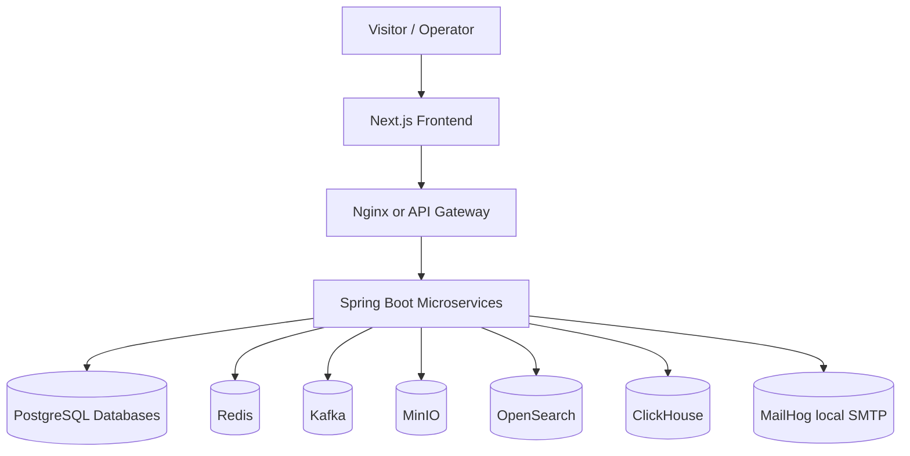
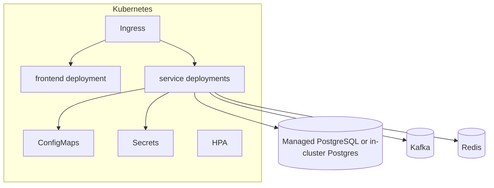

# Architecture Documentation

## System Context

## Service Topology

| Service | Port | Database | Controllers | Entities | Migrations | Responsibility |
| --- | --- | --- | --- | --- | --- | --- |
| audience-service | 8082 | ${DB_NAME:legent_audience | 9 | 12 | 13 | Subscribers, lists, segments, imports, consent, suppressions, preferences. |
| automation-service | 8086 | ${DB_NAME:legent_automation | 2 | 5 | 3 | Workflow definitions, graph validation, schedules, runs, simulations. |
| campaign-service | 8083 | ${DB_NAME:legent_campaign | 5 | 17 | 13 | Campaigns, audiences, approvals, experiments, budgets, frequency, send jobs. |
| content-service | 8090 | ${DB_NAME:legent_content | 8 | 14 | 7 | Email templates, content blocks, assets, landing pages, test sends, approvals. |
| deliverability-service | 8087 | ${DB_NAME:legent_deliverability | 5 | 6 | 7 | Sender domains, DNS verification, reputation, spam scoring, DMARC, suppression. |
| delivery-service | 8084 | ${DB_NAME:legent_delivery | 2 | 12 | 11 | Provider routing, queue operations, replay, warmup, rate limits, safety evaluation. |
| foundation-service | 8081 | ${DB_NAME:legent_foundation | 15 | 11 | 11 | Tenants, feature flags, branding, admin configuration, bootstrap, public content. |
| identity-service | 8089 | ${DB_NAME:legent_identity | 2 | 11 | 8 | Authentication, sessions, account membership, onboarding state, preferences. |
| platform-service | 8088 | ${DB_NAME:legent_platform | 4 | 6 | 4 | Notifications, webhooks, search indexing, tenant integration utilities. |
| tracking-service | 8085 | ${DB_NAME:legent_tracking | 4 | 3 | 7 | Open/click ingestion, analytics summaries, funnels, websocket analytics. |

## Runtime Flow

```mermaid
flowchart LR
  Signup[Signup/Login] --> Context[Tenant + Workspace Context]
  Context --> Audience[Audience Setup]
  Audience --> Content[Template/Content]
  Content --> Campaign[Campaign Creation]
  Campaign --> Readiness[Launch Readiness]
  Readiness --> Send[Send Job]
  Send --> Delivery[Delivery Routing]
  Delivery --> Tracking[Open/Click Tracking]
  Tracking --> Analytics[Analytics Feedback]
  Analytics --> Optimization[Experiments + Automation]
```

## Database Ownership

Each service owns its schema through Flyway migrations. Local Compose creates service-specific databases.

| Service | Count | Migrations |
| --- | --- | --- |
| audience-service | 26 | V10__add_created_at_to_list_memberships.sql V11__add_created_at_to_segment_memberships.sql V12__add_updated_at_to_suppressions.sql V13__workspace_scope_and_idempotency.sql V1__audience_schema.sql V2__consent_and_double_optin.sql V3__add_deleted_at_to_consent_records.sql V4__add_version_to_consent_records.sql V5__add_created_by_to_data_extension_fields.sql V6__add_base_entity_columns_to_all_tables.sql V7__add_updated_at_to_all_tables.sql V8__add_created_by_to_all_tables.sql V9__add_all_base_entity_to_data_extension_records.sql V10__add_created_at_to_list_memberships.sql V11__add_created_at_to_segment_memberships.sql V12__add_updated_at_to_suppressions.sql V13__workspace_scope_and_idempotency.sql V1__audience_schema.sql V2__consent_and_double_optin.sql V3__add_deleted_at_to_consent_records.sql V4__add_version_to_consent_records.sql V5__add_created_by_to_data_extension_fields.sql V6__add_base_entity_columns_to_all_tables.sql V7__add_updated_at_to_all_tables.sql V8__add_created_by_to_all_tables.sql V9__add_all_base_entity_to_data_extension_records.sql |
| automation-service | 6 | V1__automation_schema.sql V3__fix_workflow_version_datatype.sql V4__automation_workspace_scope_and_idempotency.sql V1__automation_schema.sql V3__fix_workflow_version_datatype.sql V4__automation_workspace_scope_and_idempotency.sql |
| campaign-service | 26 | V10__add_all_base_entity_columns_to_send_job_checkpoints.sql V11__campaign_workspace_lifecycle_and_idempotency.sql V12__campaign_engine_enterprise.sql V13__campaign_launch_command_center.sql V1__campaign_schema.sql V2__campaign_approval_and_checkpoint.sql V3__add_content_id_to_campaigns.sql V4__add_missing_columns.sql V5__add_scheduled_at_to_campaigns.sql V6__add_missing_send_batches_columns.sql V7__add_created_by_to_send_job_checkpoints.sql V8__add_deleted_at_to_send_job_checkpoints.sql V9__add_updated_at_to_send_job_checkpoints.sql V10__add_all_base_entity_columns_to_send_job_checkpoints.sql V11__campaign_workspace_lifecycle_and_idempotency.sql V12__campaign_engine_enterprise.sql V13__campaign_launch_command_center.sql V1__campaign_schema.sql V2__campaign_approval_and_checkpoint.sql V3__add_content_id_to_campaigns.sql V4__add_missing_columns.sql V5__add_scheduled_at_to_campaigns.sql V6__add_missing_send_batches_columns.sql V7__add_created_by_to_send_job_checkpoints.sql V8__add_deleted_at_to_send_job_checkpoints.sql V9__add_updated_at_to_send_job_checkpoints.sql |
| content-service | 14 | V1__content_schema.sql V2__template_workflow.sql V3__add_created_by_to_template_approvals.sql V4__add_deleted_at_and_version_to_template_approvals.sql V5__add_base_entity_columns_to_template_versions.sql V6__add_updated_at_to_template_versions.sql V7__email_studio_enterprise.sql V1__content_schema.sql V2__template_workflow.sql V3__add_created_by_to_template_approvals.sql V4__add_deleted_at_and_version_to_template_approvals.sql V5__add_base_entity_columns_to_template_versions.sql V6__add_updated_at_to_template_versions.sql V7__email_studio_enterprise.sql |
| deliverability-service | 14 | V1__deliverability_schema.sql V2__dmarc_reporting.sql V3__add_domain_status.sql V4__add_created_by_to_sender_domains.sql V5__add_deleted_at_and_version_to_sender_domains.sql V6__add_missing_sender_domain_columns.sql V7__workspace_scope_and_event_idempotency.sql V1__deliverability_schema.sql V2__dmarc_reporting.sql V3__add_domain_status.sql V4__add_created_by_to_sender_domains.sql V5__add_deleted_at_and_version_to_sender_domains.sql V6__add_missing_sender_domain_columns.sql V7__workspace_scope_and_event_idempotency.sql |
| delivery-service | 22 | V10__inbox_first_delivery_intelligence.sql V11__campaign_experiment_lineage.sql V1__delivery_schema.sql V2__encrypt_provider_passwords.sql V3__provider_health_and_replay.sql V4__fix_message_logs_audit_fields.sql V5__add_content_reference_to_message_logs.sql V6__fix_provider_health_audit_fields.sql V7__fix_suppression_signals_audit_fields.sql V8__message_logs_campaign_reconciliation.sql V9__workspace_strict_idempotency_and_lineage.sql V10__inbox_first_delivery_intelligence.sql V11__campaign_experiment_lineage.sql V1__delivery_schema.sql V2__encrypt_provider_passwords.sql V3__provider_health_and_replay.sql V4__fix_message_logs_audit_fields.sql V5__add_content_reference_to_message_logs.sql V6__fix_provider_health_audit_fields.sql V7__fix_suppression_signals_audit_fields.sql V8__message_logs_campaign_reconciliation.sql V9__workspace_strict_idempotency_and_lineage.sql |
| foundation-service | 22 | V10__admin_operations_sync_events.sql V11__widen_platform_core_tenant_ids.sql V1__foundation_schema.sql V2__admin_schema.sql V3__initial_data.sql V4__tenant_audit_and_config_versioning.sql V5__add_config_version_to_system_configs.sql V6__platform_core_foundation.sql V7__admin_settings_engine_and_bootstrap.sql V8__public_content_cms.sql V9__public_contact_requests.sql V10__admin_operations_sync_events.sql V11__widen_platform_core_tenant_ids.sql V1__foundation_schema.sql V2__admin_schema.sql V3__initial_data.sql V4__tenant_audit_and_config_versioning.sql V5__add_config_version_to_system_configs.sql V6__platform_core_foundation.sql V7__admin_settings_engine_and_bootstrap.sql V8__public_content_cms.sql V9__public_contact_requests.sql |
| identity-service | 16 | V1__identity_schema.sql V3__identity_constraints.sql V4__add_base_entity_columns_to_users.sql V5__initial_data.sql V6__add_refresh_tokens.sql V7__platform_core_identity_bridge.sql V8__widen_identity_bridge_ids.sql V9__auth_recovery_onboarding_and_preferences.sql V1__identity_schema.sql V3__identity_constraints.sql V4__add_base_entity_columns_to_users.sql V5__initial_data.sql V6__add_refresh_tokens.sql V7__platform_core_identity_bridge.sql V8__widen_identity_bridge_ids.sql V9__auth_recovery_onboarding_and_preferences.sql |
| platform-service | 8 | V1__platform_schema.sql V2__platform_webhooks_soft_delete.sql V3__add_webhook_retries_table.sql V4__add_webhook_retries_fk.sql V1__platform_schema.sql V2__platform_webhooks_soft_delete.sql V3__add_webhook_retries_table.sql V4__add_webhook_retries_fk.sql |
| tracking-service | 14 | V1__tracking_schema.sql V3__tracking_hardening.sql V4__tracking_hourly_agg.sql V5__enhanced_tracking.sql V6__add_created_at_to_subscriber_summaries.sql V7__tracking_workspace_and_idempotency.sql V8__campaign_experiment_lineage.sql V1__tracking_schema.sql V3__tracking_hardening.sql V4__tracking_hourly_agg.sql V5__enhanced_tracking.sql V6__add_created_at_to_subscriber_summaries.sql V7__tracking_workspace_and_idempotency.sql V8__campaign_experiment_lineage.sql |

## Deployment View

