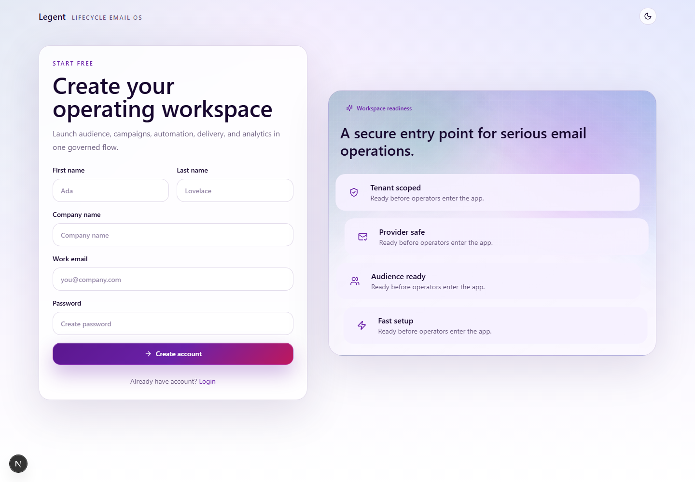
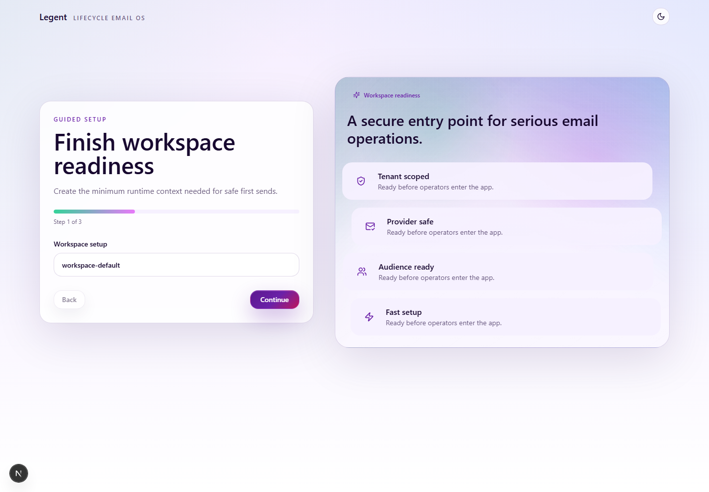
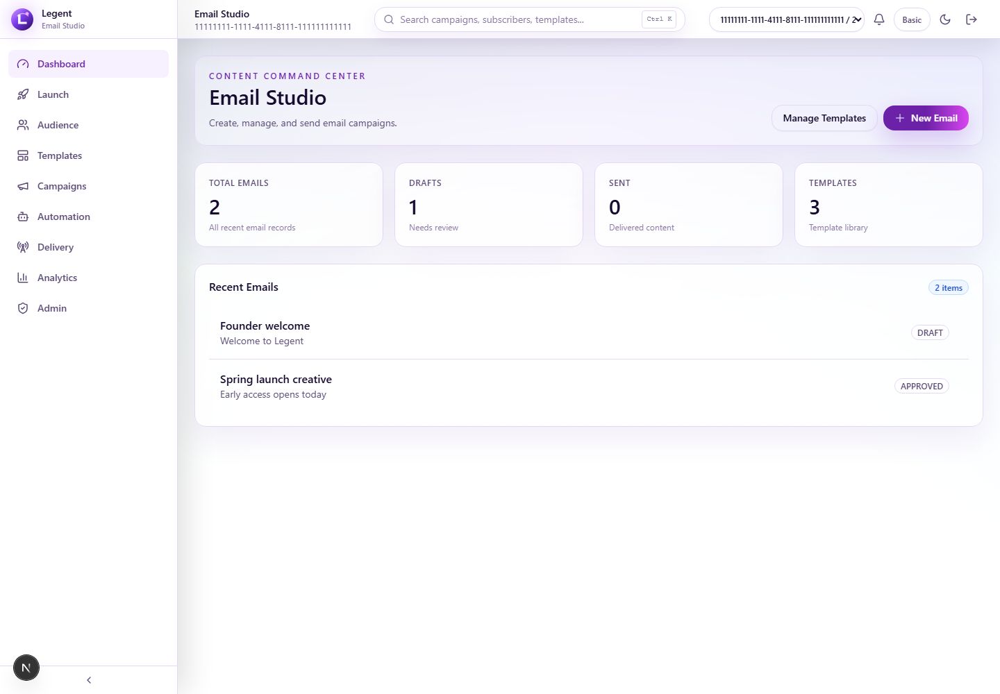
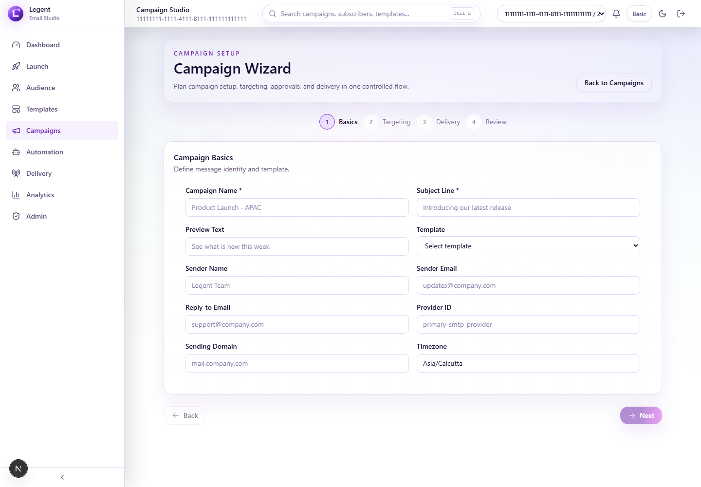
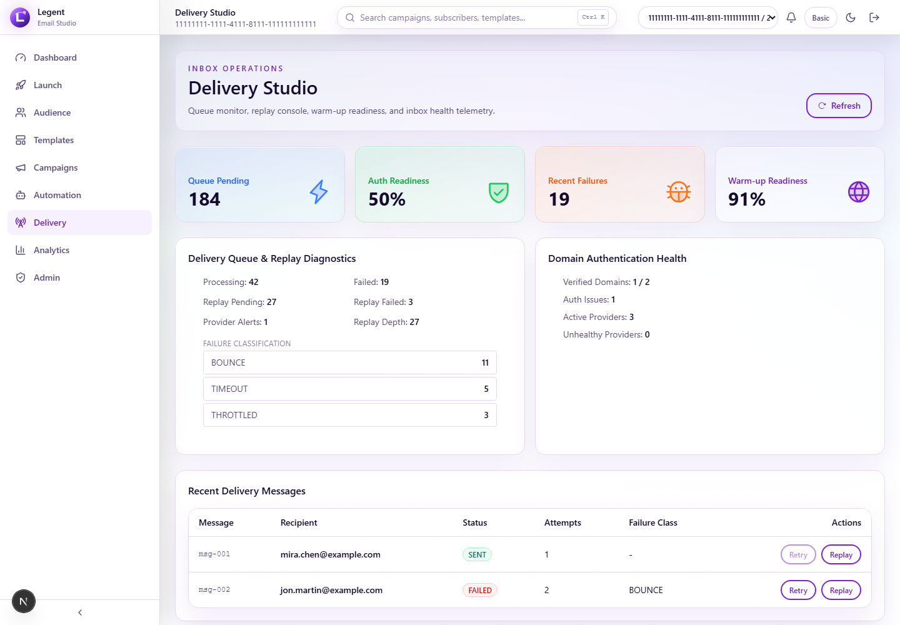
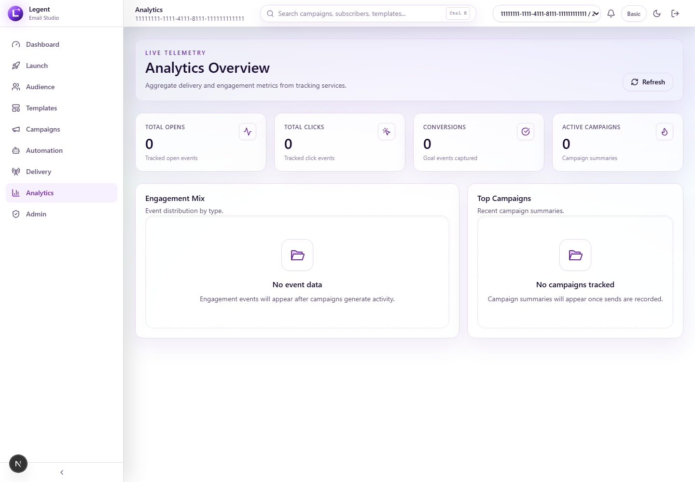

# User Guide With Screenshots

This guide follows a complete operator journey through the product. Screenshots are captured from deterministic frontend data so the screens remain stable for documentation.

## 1. Public Homepage

*Homepage: product positioning and launch command story*

## 2. Product Features

*Features: governed operating model*

## 3. Product Modules

*Modules: six studios and shared runtime fabric*

## 4. Signup

*Signup: create operating workspace*

## 5. Onboarding

*Onboarding: workspace, sender, provider readiness*

## 6. Email Studio

*Email Studio: content operations landing page*

## 7. Template Studio

*Template Studio: reusable templates and creative assets*

## 8. Audience Studio

*Audience Studio: subscriber/list/segment workspace*

## 9. Subscribers

*Subscribers: operator view of contacts and lifecycle state*

## 10. Campaigns

*Campaigns: governed campaign list*

## 11. Campaign Wizard

*Campaign Wizard: setup, audience, controls, review*

## 12. Launch Command Center

*Launch: readiness scan and confirm launch action*

## 13. Tracking

*Tracking: safety, experiments, budget, DLQ, variant analytics*

## 14. Automation

*Automation Builder: workflow graph and lifecycle automation*

## 15. Deliverability

*Deliverability: domains, DNS, reputation, sender health*

## 16. Analytics

*Analytics: live performance and reporting*

## 17. Admin

*Admin: operations, users, roles, runtime controls*

## 18. Settings

*Settings: platform preferences and deliverability configuration*
